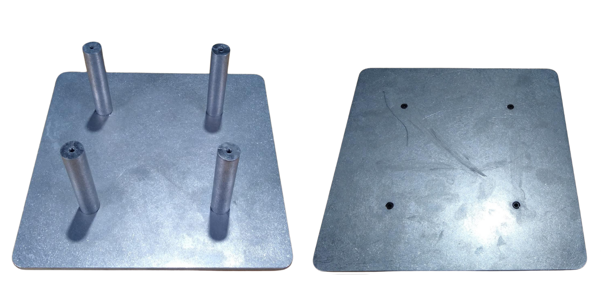
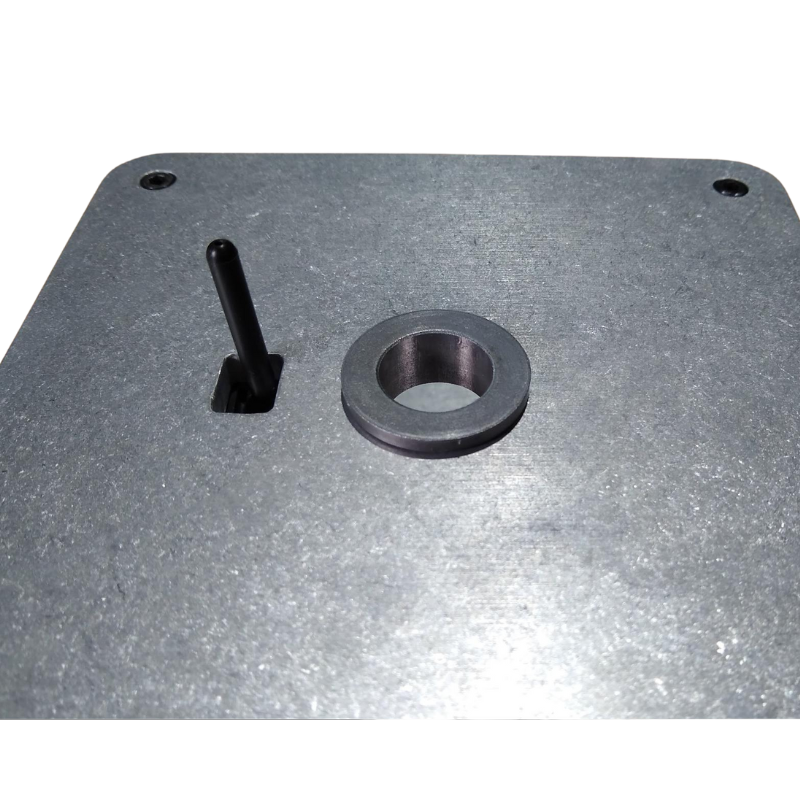

# Creep Deformation Apparatus

{: style="height:300px"}

This documentation covers part number <a
href="https://leemangeophysical.com/product/creep-deformation-apparatus/"
target="_blank" rel="noopener noreferrer">10-0000034</a>.

## Assembly Instruction
### Hazards Summary/Required PPE
* Choking Hazard, Small Parts
* Pinching Hazard

### Included Materials
* Base Plate
* Top Plate
* Mass Plate
* Standoffs (4x)
* Shaft
* Shaft Bushing
* Bushing Retainer
* Board
* Linear Potentiometer
* 10-32 x ¾” Screws (8x)
* 10-32 x ½” Screw (1x)
* 4-40 x 3/16” Screws (6x)

### Tools Required: 
* 9/32” Hex Wrench (not included)
* 3/32” Hex Wrench (not included)

### Assembly
1. Unpack the materials needed for assembly. Make sure that all the components are included in your kit. 

1. Install the standoffs in the base plate using (qty 4) 10-32 x ¾ screws as shown. Ensure the screw heads are countersunk in the plate. 
    

    {: style="height:300px"}
    

1. Install the potentiometer and board to the top plate using the included 4-40 x 3/16” Screws. (The potentiometer must be installed square to the top plate to prevent measurement error.)

1. Attach the assembled top plate to the bottom plate so that the board and potentiometer are on the bottom. Use (qty 4) 10-32 x ¾” screws. 
    

    {: style="height:300px"}
    

1. Press the shaft bushing into the top plate. Make sure it is seated completely. 
    

    {: style="height:300px"}
    

1. Install the bushing retainer on the bottom side of the top plate and tighten the set screw to secure it. 

1. Install the shaft to the mass plate using a 10-32 x ½” Screw as shown.  The shaft should fit tightly into the pocket on the mass plate. 
    

    {: style="height:300px"}
    

1. Slide the shaft into the bushing on the top plate. A light coating of white lithium grease can be applied to the shaft to prevent friction.

1. Assembly is now complete. See the <a href="https://docs.google.com/document/d/1W3iEJtaS3IZBW6_7TTSE4s6wmuLl6XAKVrbR2w8l0BM/edit#heading=h.dj54izm0lwup" target="_blank" rel="noopener noreferrer">lab activity</a> for calibration and usage instructions.  