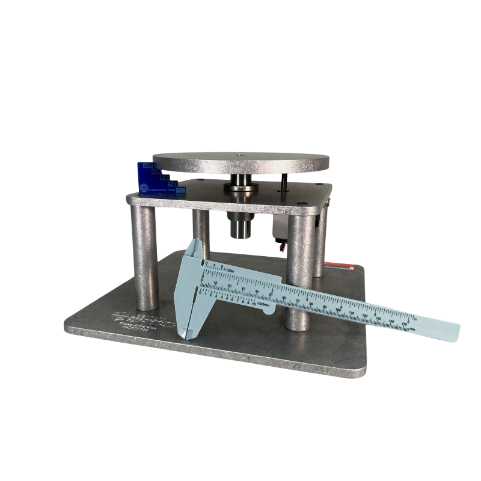
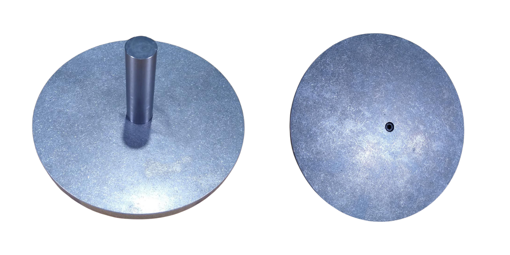
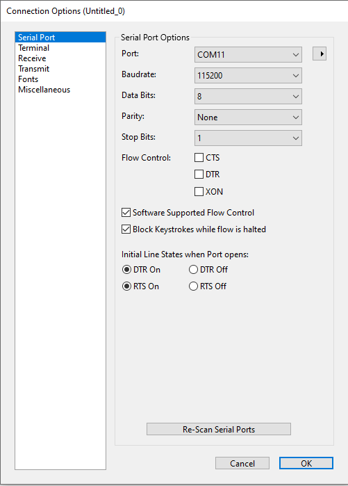
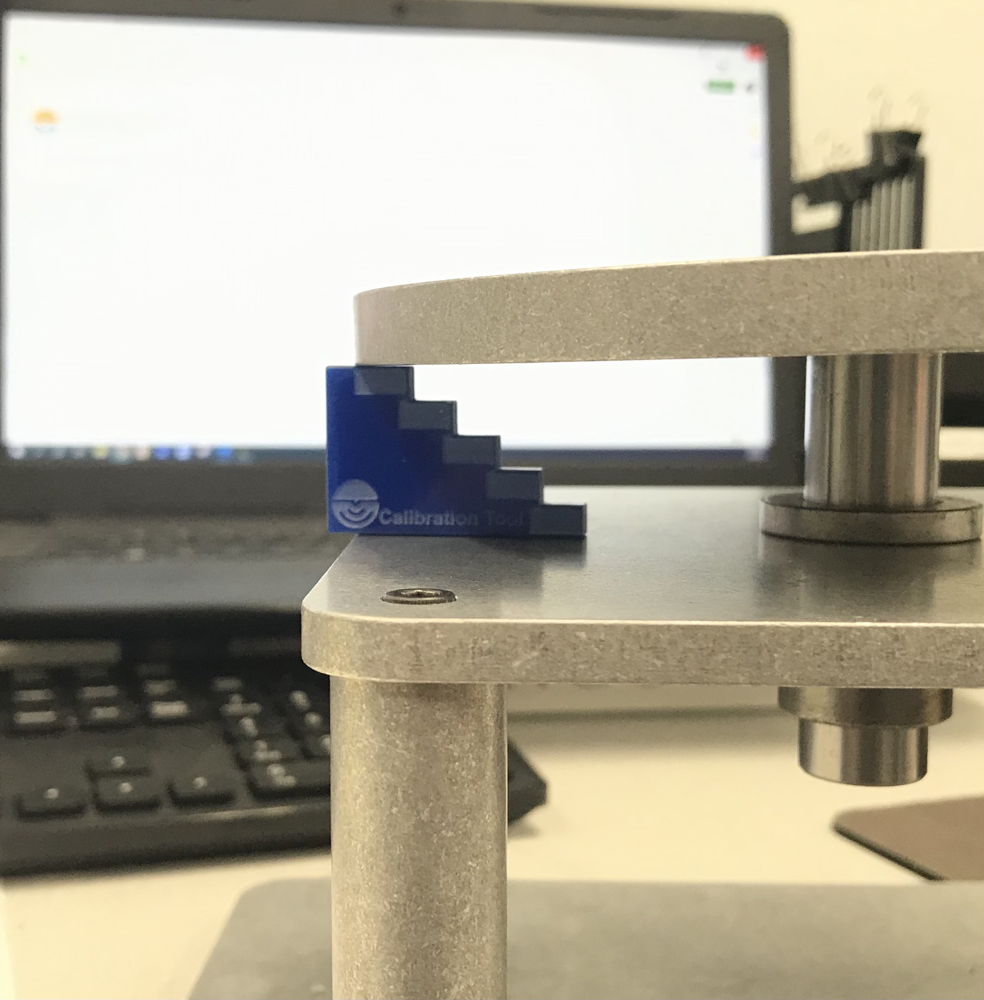
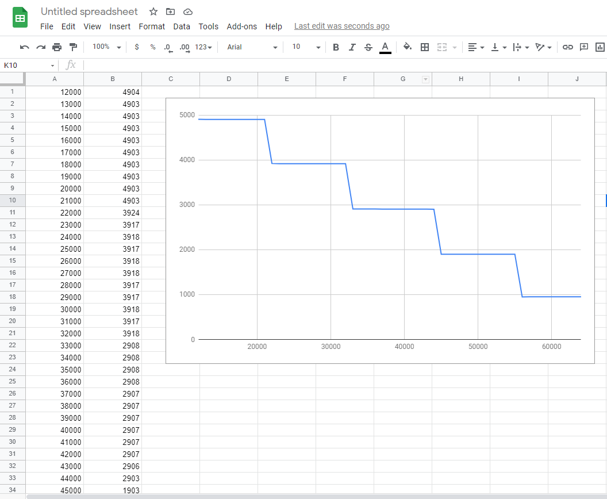
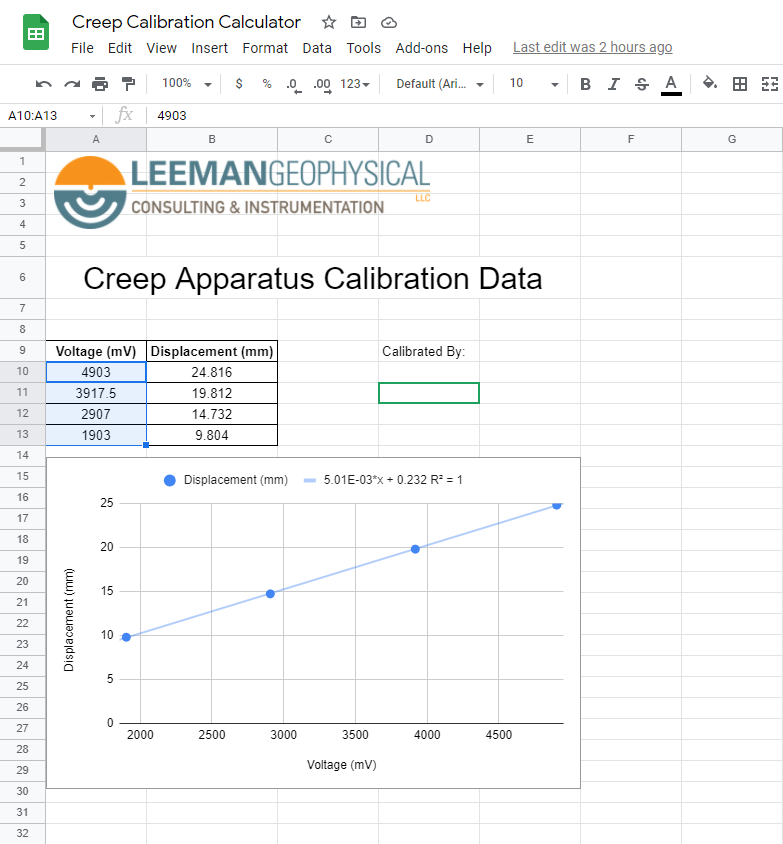
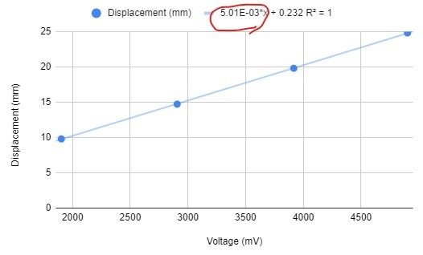
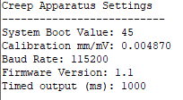

# Creep Deformation Apparatus

{: style="height:300px"}

This documentation covers part number <a
href="https://leemangeophysical.com/product/creep-deformation-apparatus/"
target="_blank" rel="noopener noreferrer">10-0000034</a>.

## Overview
<iframe width="560" height="315" src="https://www.youtube.com/embed/QaOigznFLUs?si=NEF8doBoZ-bIDqar" title="YouTube video player" frameborder="0" allow="accelerometer; autoplay; clipboard-write; encrypted-media; gyroscope; picture-in-picture; web-share" referrerpolicy="strict-origin-when-cross-origin" allowfullscreen></iframe>
The Creep Deformation Apparatus is a lab activity that demonstrates the physics
of how materials like rock and ice can deform by slowly creeping. We can learn
about their properties by simulating and observing creep, and deriving flow
laws. It is able to measure and record the dispacement of samples, and can be
used to collect data for later analysis, as well as for simple qualitative
demonstrations.

### What's in the box
Upon receipt of your unit, unpack the contents of the box and inspect all parts
for any damage incurred during shipping. Immediately report any missing parts or
damage to Leeman Geophysical for replacement.  

* Creep Apparatus
* 6 In. Utility Caliper
* Calibration Tool
* USB Mini-B 2.0 Cable 
* Wax Cylinder Pack (x10 samples)
* Bearing Retainer
* 6-32, 1/8" Set Screw (x3)  

## Assembly Instruction
### Hazards Summary/Required PPE
* Choking Hazard, Small Parts
* Pinching Hazard

### Included Materials
* Base Plate
* Top Plate
* Mass Plate
* Standoffs (4x)
* Shaft
* Shaft Bushing
* Bushing Retainer
* Board
* Linear Potentiometer
* 10-32 x ¾” Screws (8x)
* 10-32 x ½” Screw (1x)
* 4-40 x 3/16” Screws (6x)

### Tools Required: 
* 9/32” Hex Wrench (not included)
* 3/32” Hex Wrench (not included)

### Assembly
1. Unpack the materials needed for assembly. Make sure that all the components are included in your kit. 

1. Install the standoffs in the base plate using (qty 4) 10-32 x ¾ screws as shown. Ensure the screw heads are countersunk in the plate. 
    

    {: style="height:300px"}
    

1. Install the potentiometer and board to the top plate using the included 4-40 x 3/16” Screws. (The potentiometer must be installed square to the top plate to prevent measurement error.)

1. Attach the assembled top plate to the bottom plate so that the board and potentiometer are on the bottom. Use (qty 4) 10-32 x ¾” screws. 
    

    {: style="height:300px"}
    

1. Press the shaft bushing into the top plate. Make sure it is seated completely. 
    

    {: style="height:300px"}
    

1. Install the bushing retainer on the bottom side of the top plate and tighten the set screw to secure it. 

1. Install the shaft to the mass plate using a 10-32 x ½” Screw as shown.  The shaft should fit tightly into the pocket on the mass plate. 
    

    {: style="height:300px"}
    

1. Slide the shaft into the bushing on the top plate. A light coating of white lithium grease can be applied to the shaft to prevent friction.

1. Assembly is now complete.

## Calibration
This guide will walk you through the calibration process for the Creep
Deformation Apparatus.

### Required Equipment
* Calibration Step tool
* USB Mini B
* Calipers

The calibration procedure requires the use of a serial terminal. For these instruction we recommend the CoolTerm software. The list below shows all required programs and the links to find them.

* <a href="https://coolterm.en.lo4d.com/windows" target="_blank" rel="noopener noreferrer">CoolTerm</a>
* <a href="" target="_blank" rel="noopener noreferrer">Creep Calibration Calculator</a>
* Google Sheets

### Calibration Procedure  
1. Plug the device into your computer using the USB Mini B cable.
1. Open the CoolTerm Program and select the **Options** tab.
1. Make sure your device is plugged in and then select the **Re-Scan Serial
   Ports** button
1. Select the correct port and then set the **Baudrate** to 115200 and then
   press **OK**
    

    {: style="height:600px"}
    

    After you close this window, select **Connect** in the main window. The terminal should now start showing data once a second.  
1. Next you will want to take the calibration tool and set it underneath the
   weight plate as pictured. In all caps typed the following command into the
   terminal.  
   <code>SETCAL 1.0</code>  
    NOTE: This command must, be in all caps, include the space, and confirmed
    with the enter key.
    

    {: style="height:400px"}
    

1. Under the **Connection** Tab, select **Capture to Text/Binary File**.  
    Once you select start, It will ask you where you want to save the data to.
    Save the data CSV somewhere convenient for you. (i.e. Desktop) Your data is
    recording, in about ten second intervals, slide the Calibration tool back
    one step. After the first four steps of the calibration tool have been
    recorded for ten seconds, select stop.  
    

    {: style="height:400px"}
    

1. Open up a blank google sheets and import the CSV file. Your data should be
   inserted to the first two columns. Create a graph of this data under the
   insert tab.
    

    {: style="height:400px"}
    

1. Open the <a href="https://docs.google.com/spreadsheets/d/1QmQ7DUTds2T-uK3FIgHSmwCH66fnEnDyPsL-y6NH2Ao/edit?pli=1#gid=0" target="_blank" rel="noopener noreferrer">Creep
   Calibration Calculator</a>. Measure the calibration tools first 4 larges
   steps and enter those values, greatest to least, in the Displacement column. 
   Using The graph you just created, hover your mouse over each step and enter
   the most common value for each step into the blue highlighted section of the
   calculator spreadsheet.  
   The calculator graph should now have the correct calibration line. Print the
   page and keep that sheet and the calibration tool with its corresponding
   Creep Apparatus.
    

    {: style="height:400px"}
    

1. Navigate back to CoolTerm where your data should still be coming in once per
   second.  
   In this terminal, you will type the command <code>SETCAL x.xxxxxx</code>  
   The Calibration number you will use in place of the x.xxxxxx is located in
   the red circled number pictured below in the creep apparatus calculator. It
   must be entered as a decimal value, not it scientific notation.
    

    {: style="height:300px"}
    

1. This concludes the calibration procedure. To checkout that the calibration
   has been applied properly, type the command <code>SHOW</code>
    

    {: style="height:150px"}
    

## Teachers Guide
### Introduction
Rocks in the Earth can deform in many different ways, but the main distinction
often made is if the deformation is brittle or ductile. Brittle deformation
occurs in the cold upper crust where rocks are squeezed and store energy like
springs. They keep storing more and more energy until they fail and break. This
is the mode of deformation associated with things like earthquakes. Ductile
deformation on the other hand is the slow movement of material, often associated
with hot rocks under extreme pressures deep within the planet. Creep deformation
is associated with tectonic scale deformation, flow of the Earth’s mantle, and
more.  

There are even different styles of creep such as diffusion and dislocation
creep. Diffusion creep is generally associated with higher temperature
deformation and is the movement of vacancies in a crystal’s structure through
the material. Dislocation creep is the movement of a dislocation or imperfection
in the crystal and generally is the dominant type of creep at lower
temperatures. Dislocation creep doesn’t depend on the grain size of the
material, but diffusion creep does.  

Since different materials melt at different temperatures, we talk about how
“high” or “low” the temperature is relative to the melting point of the
material. The ratio of the current temperature of the material to its melting
point is called the homologous temperature.  

$$T_H = {T(K) \over T_mp(K)}$$  

Similarly, we often do not want to worry about the absolute length of a sample,
but we care much more about its change in length relative to its size. For
example, shortening a football field by a meter would hardly be noticeable, but
shortening your desk by a meter would be! To describe length change relative to
the size of something, scientists use a quantity called strain. Strain is
defined as the change in length divided by the initial length. The strain rate
is the change in strain over time. For example a sample that was at a strain of
0.01 initially, then at 0.06 after 10 minutes would be experiencing a strain
rate of 0.005 strain/minute.  

Dislocation creep is described as a “power law” relationship, meaning that it
works in a non-linear way. It relates the strain rate of a material under a load
to the stress and material/physical properties through the use of a “stress
exponent”.  

$$\dot\epsilon=A\sigma^mexp({-Q_c \over RT})$$  

There are several types of tests that we can run on a material - they involve
different imposed sets of loading conditions called boundary conditions. We can
either apply a constant load to a sample and see how it deforms and creeps under
that load, or we can apply a constant crushing motion to the sample (called a
constant displacement or constant strain rate) and measure the force that
results from that. Both tests should produce the same results, but due to the
properties of materials certain types of tests are often easier to perform on
certain materials. We will be using the constant load test, often referred to as
a “dead weight” test since we apply a given load and leave it there for the
duration of the test.  

Assuming that the temperature, materials, and load remain constant we expect to
see a sample strain in a predictable way over time. First, the sample loads
elastically, like a spring. This is recoverable deformation - if you remove the
weight, the sample springs back. Next the curve becomes more shallow in the
transient state. In this state deformation is becoming permanent as creep
begins. Finally, the curve reaches a constant slope. The sample strain rate is
constant and this represents the steady-state creep of the material.

### Lab Activity
* <a href="https://docs.google.com/document/d/1W3iEJtaS3IZBW6_7TTSE4s6wmuLl6XAKVrbR2w8l0BM/edit" target="_blank" rel="noopener noreferrer">Google Docs Lab Activity</a>

## Accessories

### Wax Core Packs (<a href="https://leemangeophysical.com/product/wax-cores/" target="_blank" rel="noopener noreferrer">2-0000262</a>)
A pack of 10 wax cores for use with our Creep Deformation Apparatus in the
classroom! Don’t run out mid-semester. We custom cast each core in-house to
ensure a consistent and quality lab experience for your students.

## Revision History

<table>
  <tr bgcolor="gray">
    <td><b>Date</b></td>
    <td><b>Changes</b></td>
  </tr>
  
  <tr>
    <td>April 2024</td>
    <td>Moved Various Documentation to MkDocs Format</td>
  </tr>
</table>
