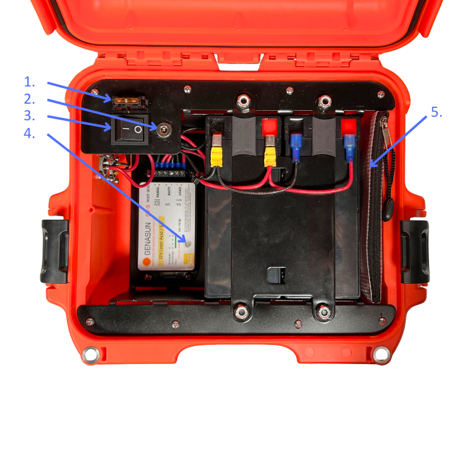
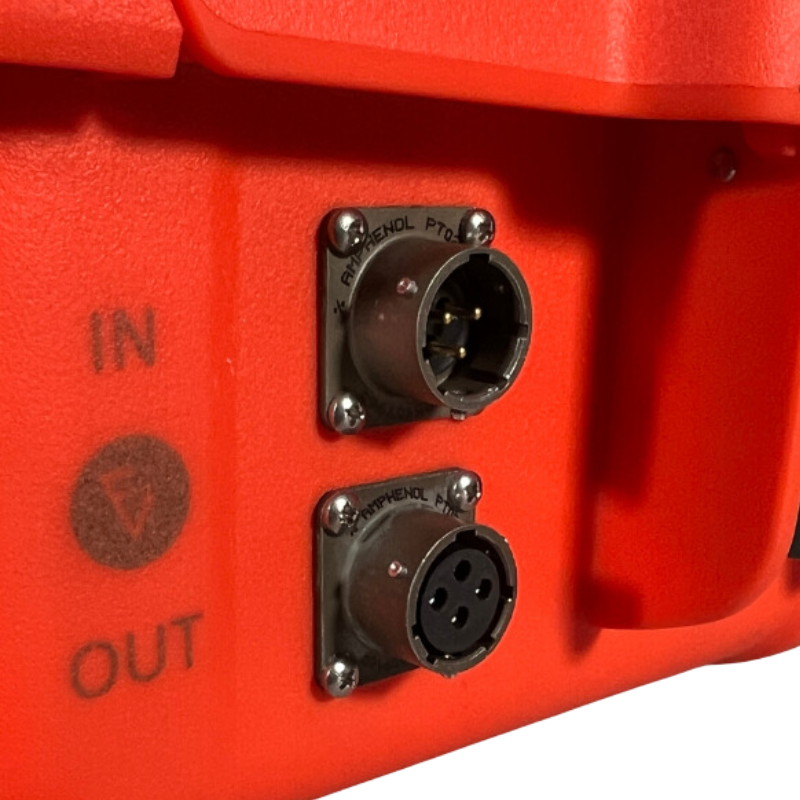

# FieldVolt Power Case

{: style="height:300px"}

This documentation covers part number <a
href="https://leemangeophysical.com/product/fieldvolt-power-case/"
target="_blank" rel="noopener noreferrer">10-0000181</a>

## Overview
Empower your field operations with the FieldVolt Power Case, the cornerstone of
the [FieldVolt system](../fieldvolt_standard.md). Designed to simplify the daunting task of powering your
equipment in the field, our system ensures seamless operation for any data
collection endeavor or field project.

<b>High Power Capacity:</b> Equipped with two 12VDC 8Ah batteries, our power
case boasts a total capacity of 16Ah, providing nearly 200Wh of reliable power
to keep your instruments running.  

<b>Effortless Charging:</b> The integrated charge controller facilitates
hassle-free charging via solar panels or wall power, ensuring uninterrupted
operation even in remote locations. Up to 65W of solar panels can be attached to
each FieldVolt power case!  
<b></b>
<b>Standardized Connectivity:</b> With standardized connectors compatible with
the FieldVolt ecosystem, effortlessly connect and adapt to any instrument,
streamlining your setup process. Make it trivial to swap power, instruments, and
adapt your deployment plan on the fly with this new standard.  

<b>Power Anything:</b> Power any instrument that draws up to 5Ah at 12 VDC from
the power case. With myriad accessories such as cables, splitters, and pigtail
leads, we can help you power just about anything with the FieldVolt system.  

<b>Safety Assured:</b> Fused batteries ensure safety, with an extra fuse
included for added peace of mind during fieldwork.  

<b>User-Friendly Design:</b> Simple single-switch operation allows you to plug
in your instruments, connect solar panels if required, and move on to the next
site. No more fiddling with battery connections and stripping wires in the
field.  

<b>Easy Maintenance:</b> Easily accessible components enable swift repairs,
battery replacements, and maintenance tasks with basic tools, ensuring
continuous operation in challenging environments.  

<b>Rugged Construction:</b> Housed in a durable and waterproof Nanuk case, our
power case withstands the rigors of fieldwork, remaining virtually
indestructible even when subjected to rough handling or environmental extremes.  

<b>Durable Connectivity:</b> Featuring metal Amphenol Industrial connectors, our
system remains resilient against water, dust, mud, and other environmental
hazards, ensuring reliable power in any field area. 

### Whats in the Box
Upon receipt of your unit, unpack the contents of the box and inspect all parts
for any damage incurred during shipping. Immediately report any missing parts or
damage to Leeman Geophysical for replacement. Note that there are many optional
accessories available, see the accessories section of the manual for details and
usage notes.  

* FieldVolt Power Case with batteries  

* Extra fuse  

* Quick Start Guide  

* Zipper Storage Pouch

### Features
* 16Ah capacity batteries come pre-installed  

* Easy to charge with up to 65W solar panels or wall chargers  

* Single standardized field volt power output connector for any instrument up to
  5A

* Fused battery connection with spare fuse  

* Single switch on/off operation  

* Easy to maintain with open design

* Durable Nanuk Case and Amphenol Industrial connectors

## Specifications
<table>
  <tr bgcolor="gray">
    <td><b>Parameter</b></td>
    <td><b>Min</b></td>
    <td><b>Typ</b></td>
    <td><b>Max</b></td>
    <td><b>Unit</b></td>
  </tr>

  <tr>
    <td colspan="5" bgcolor="gray"><b>DC Input</b></td>
  </tr>

  <tr>
    <td>Voltage</td>
    <td>-</td>
    <td>-</td>
    <td>-</td>
    <td>VDC</td>
  </tr>

  <tr>
    <td>Current</td>
    <td>-</td>
    <td>-</td>
    <td>-</td>
    <td>mA</td>
  </tr>

  <tr>
    <td colspan="5" bgcolor="gray"><b>Environmental</b></td>
  </tr>

  <tr>
    <td>Operating Temperature</td>
    <td>-</td>
    <td>-</td>
    <td>-</td>
    <td>&#8451;</td>
  </tr>

  <tr>
    <td colspan="5" bgcolor="gray"><b>Physcial</b></td>
  </tr>

  <tr>
    <td>Weight</td>
    <td>-</td>
    <td>-</td>
    <td>-</td>
    <td>g</td>
  </tr>

  <tr>
    <td>Width</td>
    <td>-</td>
    <td>-</td>
    <td>-</td>
    <td>mm</td>
  </tr>

  <tr>
    <td>Length</td>
    <td>-</td>
    <td>-</td>
    <td>-</td>
    <td>mm</td>
  </tr>

  <tr>
    <td>Height</td>
    <td>-</td>
    <td>-</td>
    <td>-</td>
    <td>mm</td>
  </tr>
</table>

## Operation
### Panel

{: style="height:450px"}

<table>
  <tr bgcolor="gray">
    <td><b>Key</b></td>
    <td><b>Description</b></td>
  </tr>

  <tr>
    <td>1</td>
    <td>5A Blade Fuse</td>
  </tr>

  <tr>
    <td>2</td>
    <td>Wall Charging Port (For use with the Field Volt Wall Charger)</td>
  </tr>

  <tr>
    <td>3</td>
    <td>Power On/Off switch</td>
  </tr>

  <tr>
    <td>4</td>
    <td>Charging Status Indicator</td>
  </tr>

  <tr>
    <td>5</td>
    <td>Field Pouch w/ Spare fuse and Schematic</td>
  </tr>
</table>

### Outside Connectors
On the outside of the device there are two connectors that follow the [FieldVolt standard](../fieldvolt_standard.md)  

* Solar Panel In  

* Instrument Power Out  

{: style="height:450px"}

## Schematic
<a href="../schematic.pdf" target="_blank" rel="noopener
noreferrer">{: style="height:450px"}</a>

## Accessories 
* [Cables](../fieldvolt_cables.md)  

* [Solar Panels](../fieldvolt_solar_panels.md)

* [Accessories](../fieldvolt_accessories.md)

## Revisions
<table>
  <tr bgcolor="gray">
    <td><b>Date</b></td>
    <td><b>Changes</b></td>
  </tr>
  
  <tr>
    <td>May 2024</td>
    <td>Initial Release</td>
  </tr>
</table>