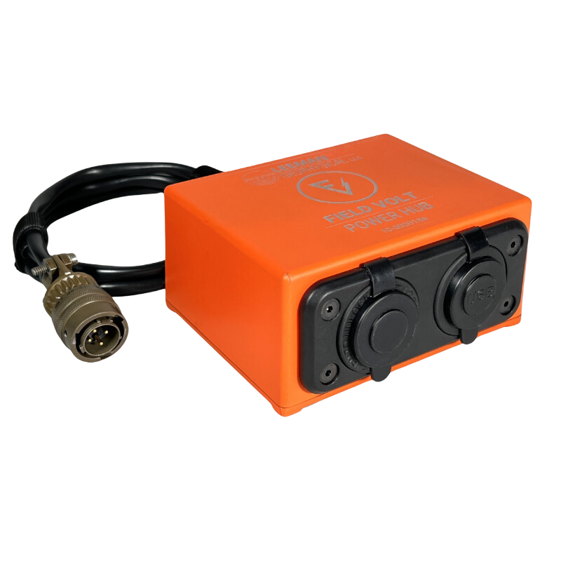
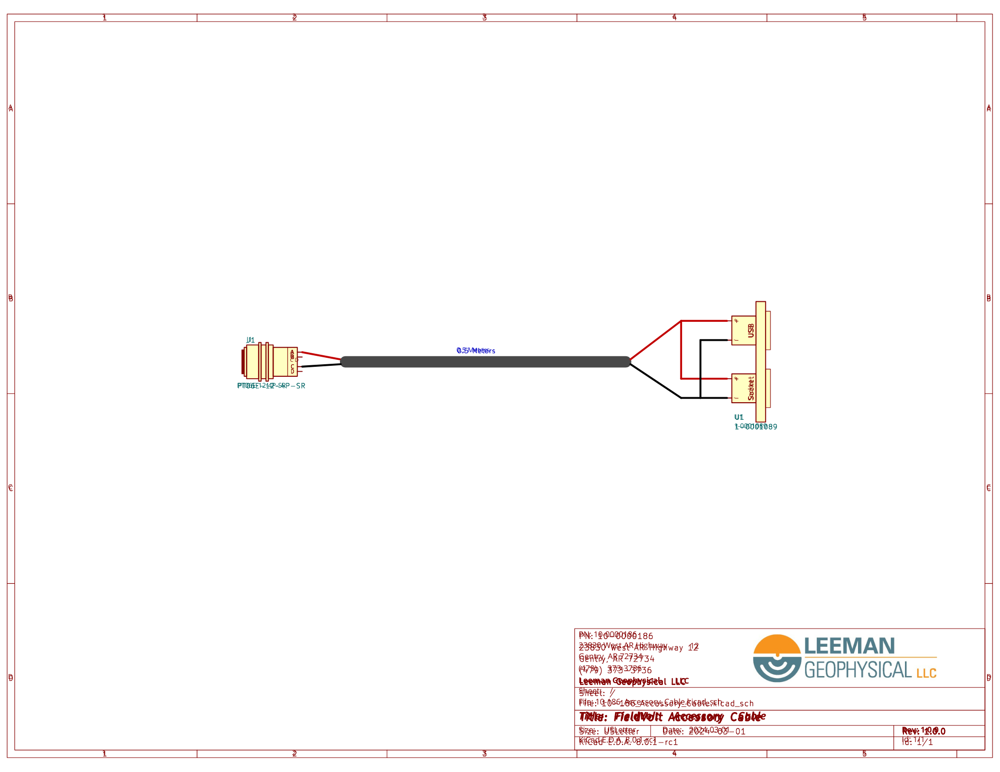

# FieldVolt Power Hub
{: style="height:300px"}

This documentation covers part number <a
href="https://leemangeophysical.com/product/fieldvolt-power-hub/"
target="_blank" rel="noopener noreferrer">10-0000186</a>

## Overview
The FieldVolt Power Hub is your ultimate solution for charging devices with ease
during your remote geological expeditions! Say goodbye to the hassle of multiple
power sources and welcome the convenience of the FieldVolt Power Hub.

Equipped with 2 USB ports and a cigarette lighter port, the Power Hub allows you
to effortlessly keep your essential equipment charged and ready for action.
Whether you’re embarking on extended remote deployments or tackling a long day
on a seismic line, the Power Hub ensures an uninterrupted power supply from the
same source you’re already utilizing for other equipment.

Crafted for durability and reliability, our Power Hub features a robust 14-gauge
water block UV-resistant cable and is engineered with sturdy Amphenol Industrial
metal connectors for the standard FieldVolt instrument power plug. Encased in a
tough cast aluminum enclosure treated with Cerakote, our Power Hub guarantees a
corrosion-free and easily visible finish, ensuring longevity even in the
harshest field conditions.

With FieldVolt, streamline your field power system and enjoy the perfect blend
of versatility and reliability. Stay powered up and focused on what truly
matters – your geological discoveries.

### Whats in the Box
Upon receipt of your unit, unpack the contents of the box and inspect all parts
for any damage incurred during shipping. Immediately report any missing parts or
damage to Leeman Geophysical for replacement. Note that there are many optional
accessories available, see the accessories section of the manual for details and
usage notes.  

* FieldVolt Power Hub

### Features
* 1m long outdoor cable  

* Durable cast aluminum enclosure  

* 2 USB charging ports  

* 1 cigarette lighter accessory port  

### Specifications 
<table>
  <tr bgcolor="gray">
    <td><b>Parameter</b></td>
    <td><b>Min</b></td>
    <td><b>Typ</b></td>
    <td><b>Max</b></td>
    <td><b>Unit</b></td>
  </tr>

  <tr>
    <td colspan="5" bgcolor="gray"><b>Physcial</b></td>
  </tr>

  <tr>
    <td>Weight</td>
    <td>-</td>
    <td>-</td>
    <td>-</td>
    <td>g</td>
  </tr>

  <tr>
    <td>Width</td>
    <td>-</td>
    <td>-</td>
    <td>-</td>
    <td>mm</td>
  </tr>

  <tr>
    <td>Length</td>
    <td>-</td>
    <td>-</td>
    <td>-</td>
    <td>mm</td>
  </tr>

  <tr>
    <td>Height</td>
    <td>-</td>
    <td>-</td>
    <td>-</td>
    <td>mm</td>
  </tr>
</table>

## Schematic

<a href="../../10-186_Power_Hub.pdf" target="_blank" rel="noopener
noreferrer">{: style="height:450px"}</a>

## Revisions
<table>
  <tr bgcolor="gray">
    <td><b>Date</b></td>
    <td><b>Changes</b></td>
  </tr>
  
  <tr>
    <td>May 2024</td>
    <td>Initial Release</td>
  </tr>
</table>

