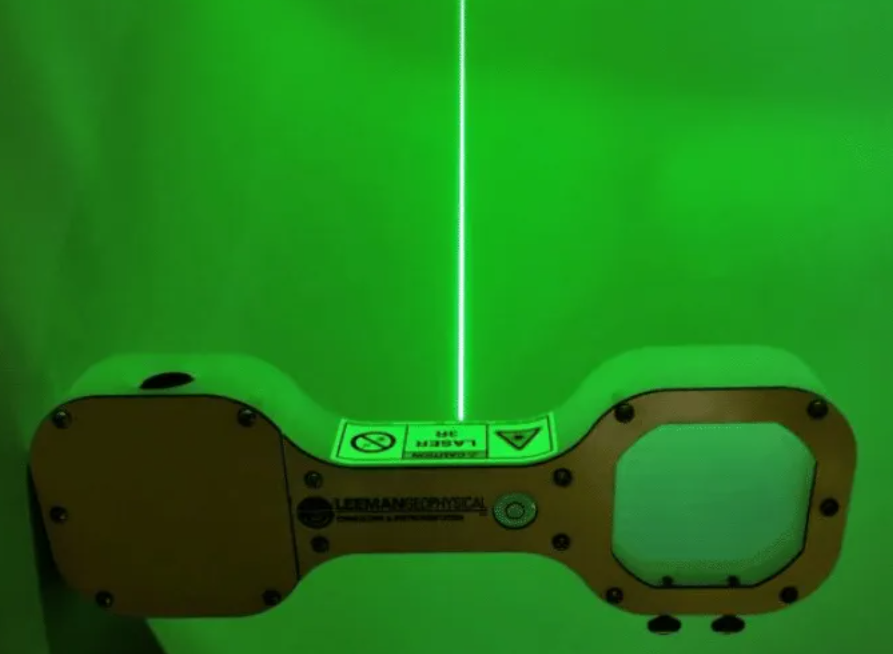
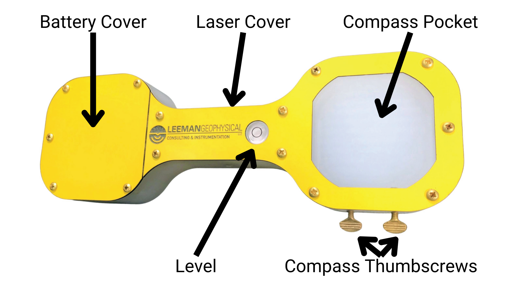
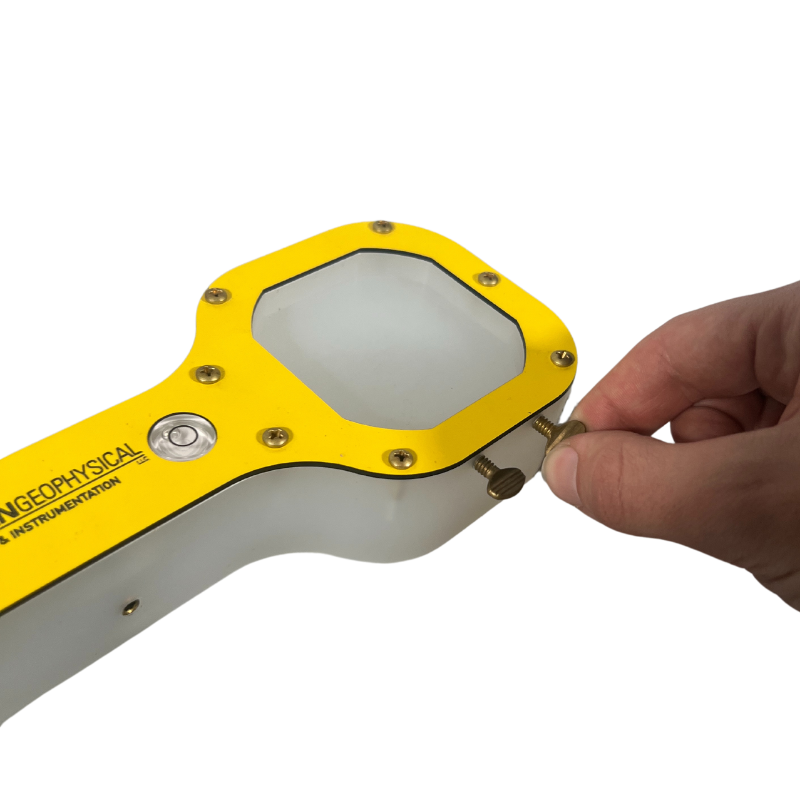
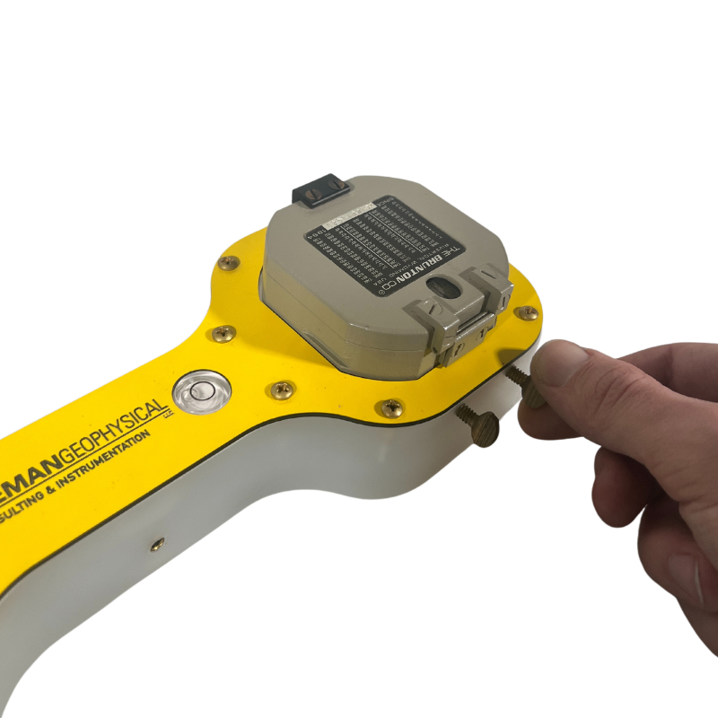
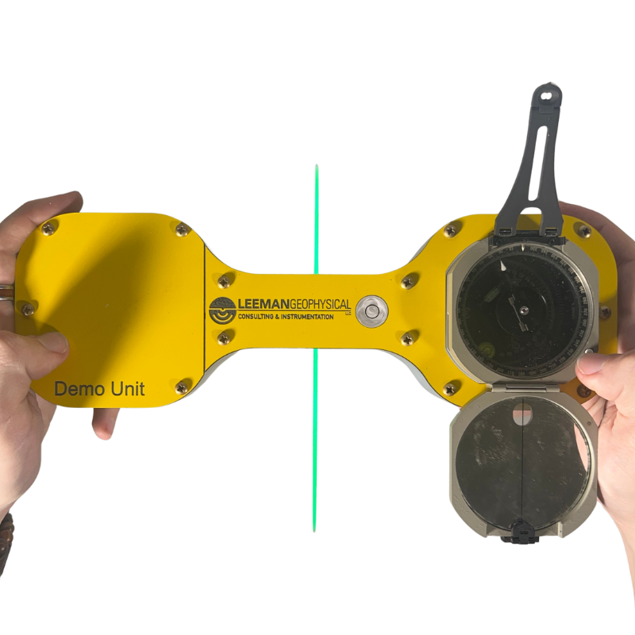
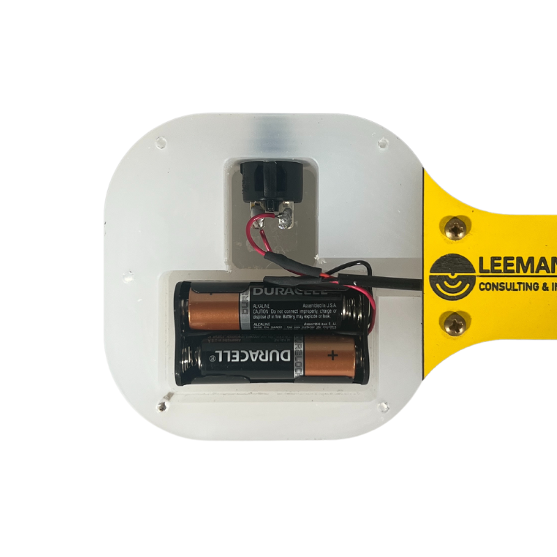
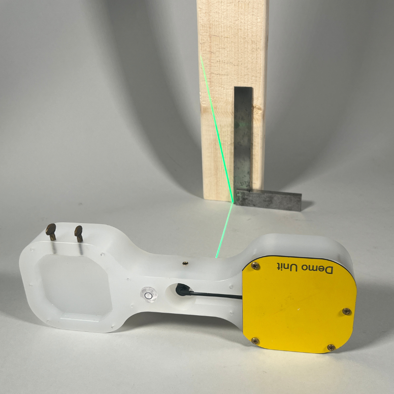
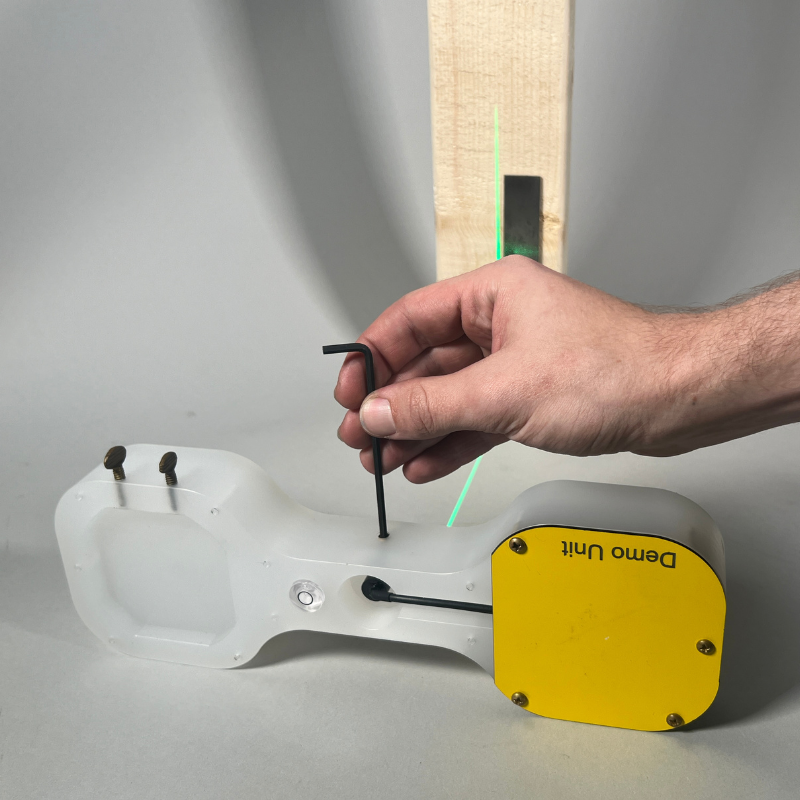
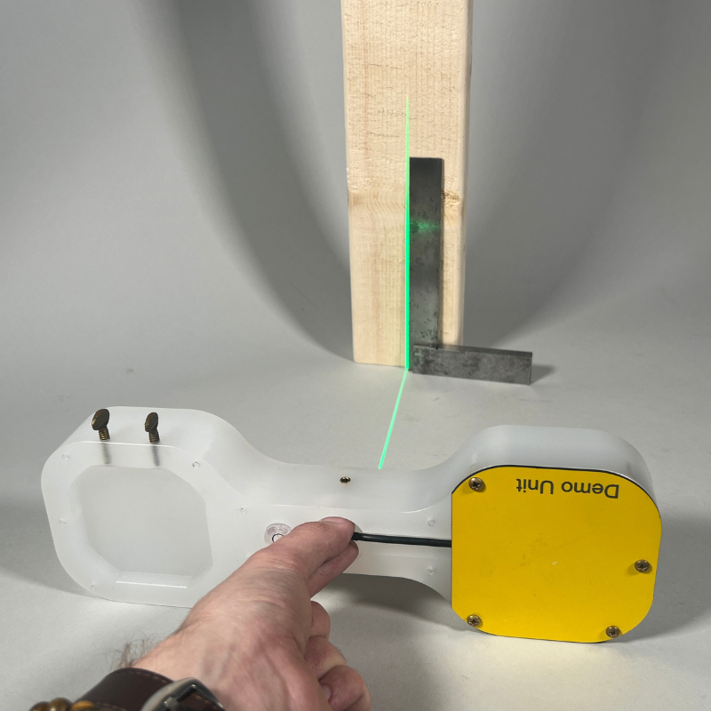

# Instrument Orientation Tool

{: style="height:250px"}

This documentation covers part number [10-0000016](https://leemangeophysical.com/product/instrument-orientation-tool/).

## Overview
If you’ve ever deployed a seismometer or other magnetic instrument in the field,
you’ve likely been frustrated with how difficult it is to measure it’s
orientation. You can’t get your compass close, but you want to take a
measurement. The inexpensive solution has been to use a straight edge top-hole
that is visually aligned with the seismometer and measure that. It’s not that
accurate, can be time consuming, and is subject to the bias of the technician.
The other options are gyrocompasses that can run into six figures or determining
the orientation with time consuming post-processing. This tool makes the process
simple, fast, and inexpensive with results of reasonable accuracy for most
seismometer, tiltmeter, and other geophysical instrument deployments at the
surface of in shallow post-holes.

Other than its low cost - one of the major advantages of the tool is that it is
in no-way a controlled technology. It utilizes a standard pocket transit and a
laser with a prism similar to that found in laser pointers used for
presentations. This makes transport of the device easy for international travel.

### Components

{: style="height:250px"}

### What's in the Box?
* Instrument Orientation Tool

## Operation
1. Verify that your pocket transit is set to the desired magnetic declination or
   to zero for declination corrections to be applied after the deployment.

1. Ensure that the two brass thumb screws projecting into the compass pocket are
   backed out until they are not protruding any into the compass area.

{: style="height:250px"}

1. Insert your pocket transit with the pointer facing away from you if you're
   holding the instrument with the text and logo upright.

{: style="height:250px"}

1. Gently tighten the thumb screws to secure the transit into position.

1. Turn on the laser by pressing and releasing the power button. **CAUTION: Do
   not look into the laser or point it at other people's eyes.**

1. Stand over the instrument and looking past the narrow section of the tool,
   align the green laser line with the orientation mark on the instrument
   (commonly a North arrow).

1. Shift your focus from the instrument to the level on the device and adjust to
   make sure it is centered. Repeat ths focus shift until you are aligned and
   level.

{: style="height:250px"}

1. Read the transit or using your right thumb depress the lock button on the
   transit and read it then. Some transits seem to shift the reading by a few
   degrees when pressed while others do not. Verify that yours does not or
   determine by how much it does and correct for it when using this method.

1. Turn off the laser and proceed to the next installation.

## Maintenance
The instrument orientation tool requires very little maintenance. Occasional
wipes with water (slightly soapy if very dirty) will help keep to looking good.
Just be sure to not submerge the instrument as it is splash resistant, not water
proof.

### Replacing the Batteries
1. Remove the five (5) brass screws holding the left side cover of the
   instrument down with a number 2 Phillips screwdriver. Remove the cover.

1. Remove and replace the two (2) AA batteries in the holder. We recommend
   standard alkaline cells from any of the major battery manufacturers.

{: style="height:250px"}

1. Replace the cover and snug the screws.

### Alignment Calibration
If you believe your instrument to be out of alignment, it can be re-sighted with
just a couple of tools in about 5-10 minutes.

1. Find a flat surface such as a table and verify that it is flat end-to-end
   (i.e. not twisted). Level does not matter as long as the table is
   self-consistent. Ideally 6-12 feet of length works well.

1. Turn on the laser being careful to avoid direct eye contact. Set the tool on
   its side (the side without the compass screws).

1. Move a square (carpenters, speed, or machinists will all work) into the beam
   at the opposite end of the table. If the laser does not follow the edge of
   the square, it needs to be realigned.

{: style="height:250px"}

1. Remove the nine (9) screws holding the right side cover down on the
   instrument with a number 2 Phillips screwdriver and remove the cover.

1. Slightly loosen the laser set screw with an allen key and grasping the laser
   body, turn it. Check the alignment with the square and continue to refine it
   until the laser exactly traces the square's profile.

{: style="height:250px"}

1. Gently secure the laser with the set screw and re-check the alignment.

{: style="height:250px"}

1. Once aligned, reinstall the top cover and nine (9) screws.

## Troubleshooting
**No laser showing** - Common causes include dead batteries or a broken wire
between the laser, switch, and batteries. Open the battery cover and check all
connections. Replace the batteries.

**Readings are incorrect** - Common causes include proximity to magnetic/ferrous
materials or mis-alignment of the tool. Verify that all magnetic materials are
removed from the immediate measurement area and that the alignment of the tool
is correct.