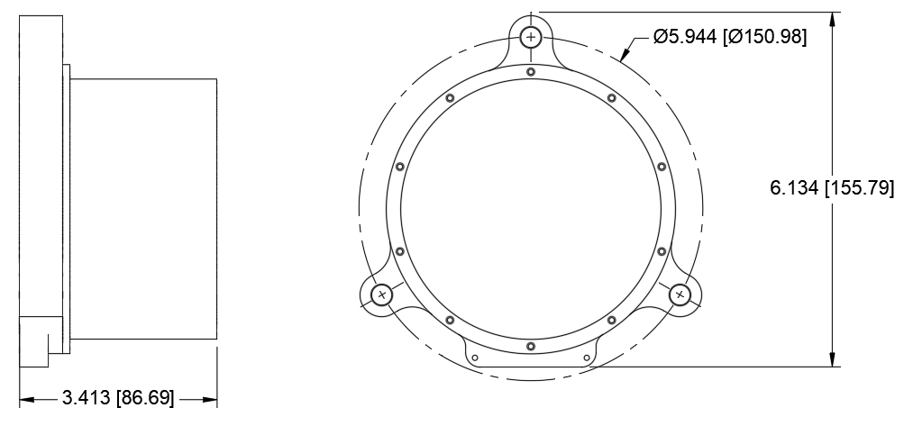
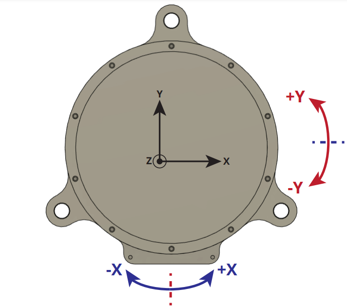
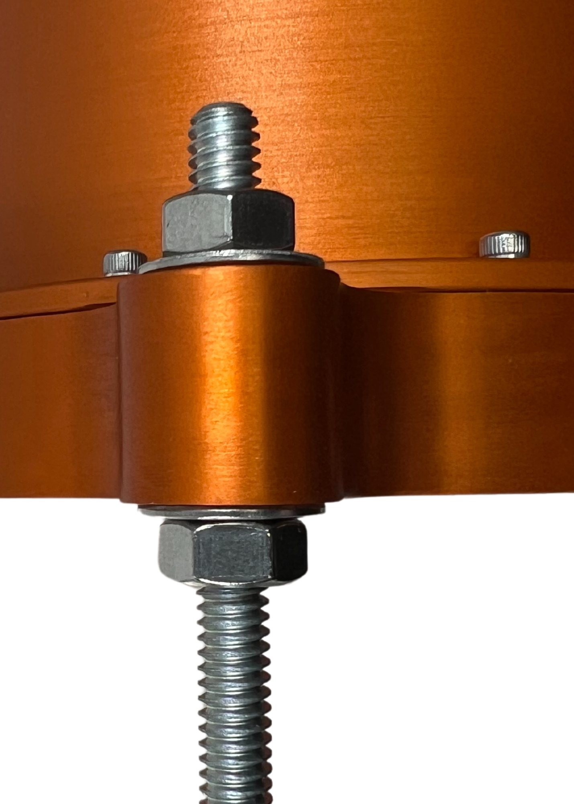
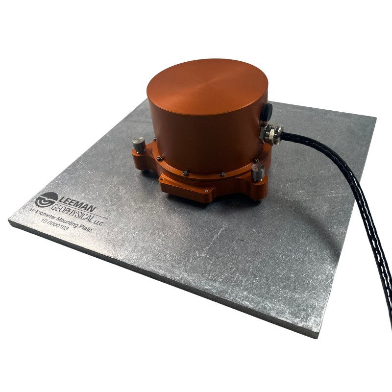
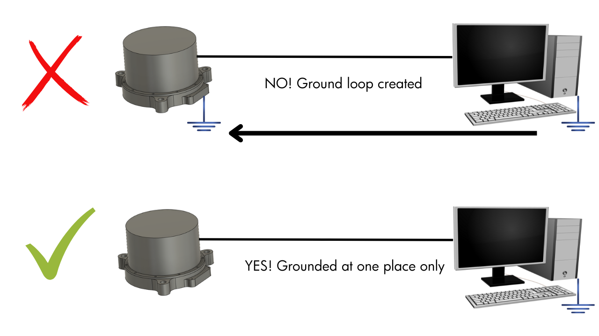
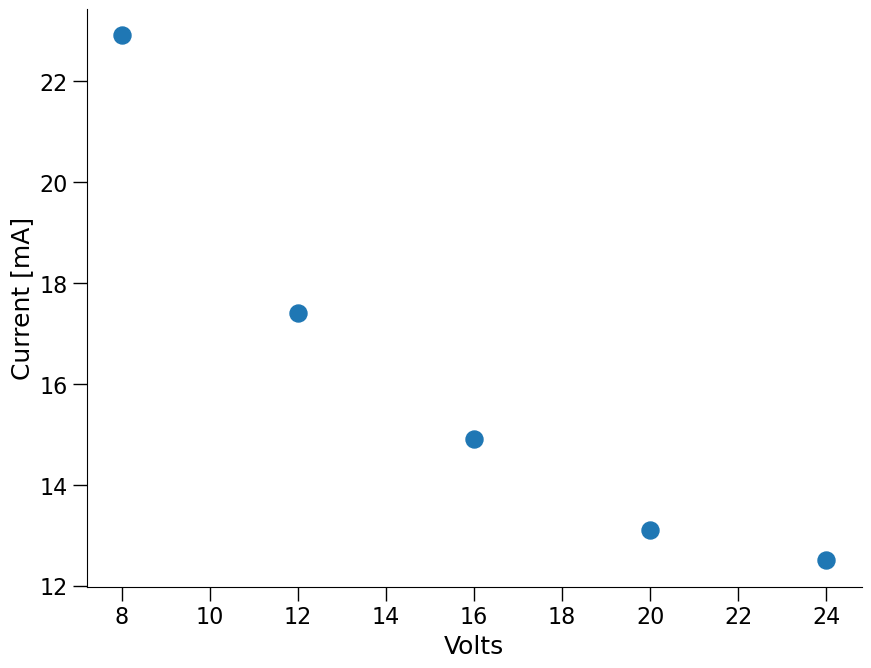
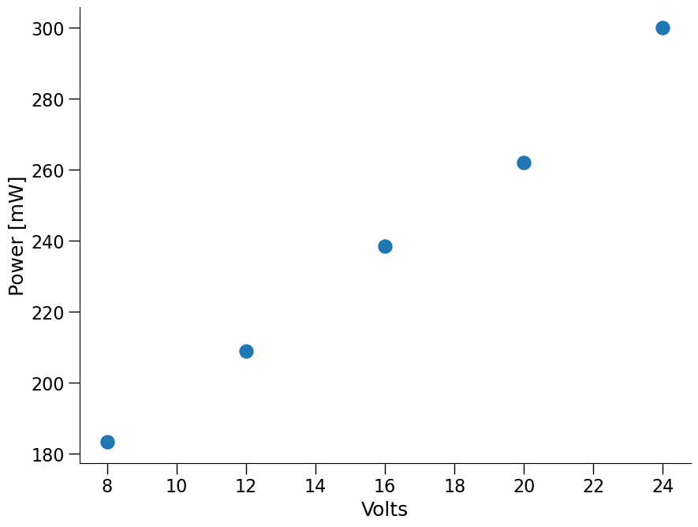
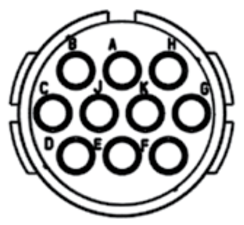

# PTM102 Precision Tilt Meter

{: style="height:250px"}

This documentation covers part number [10-0000038](https://leemangeophysical.com/product/precision-tilt-meters/).

## Overview
The PTM102 is the easiest to use and most versatile electrolytic geotechnical
tilt meter on the market. This instrument uses two electrolytic sensor elements
to determine tilts as small as sub-microradian (depending upon the range
selected) on a very small power budget, making it ideally suited for remote
installations with solar power or in polar environments where even solar power
is limited. The instrument consists of a main circuit board and a surge
suppression circuit board that can be easily changed with no soldering as a
field-repair for damaged instruments. Data are output as RS-232 serial data at a
user selected baud rate in a plain text format. Custom output formats can be
created to integrate with other systems by request at the time of order. Data
are output in raw, uncalibrated, and uncorrected form to allow the maximum
versatility in post-processing. Each unit is factory tested and calibration is
available from -40◦C to 60◦C.

### What’s in the Box
Upon receipt of your unit, unpack the contents of the box and inspect all parts
for any damage incurred during shipping. Immediately report any missing parts or
damage to Leeman Geophysical for replacement. Note that there are many optional
accessories available, see the accessories section of the manual for details and
usage notes.
* PTM102 Tilt Meter

## Specifications
<table>
  <tr bgcolor="gray">
    <td><b>Parameter</b></td>
    <td><b>Min</b></td>
    <td><b>Typ</b></td>
    <td><b>Max</b></td>
    <td><b>Unit</b></td>
  </tr>

  <tr>
    <td colspan="5" bgcolor="gray"><b>DC Input</b></td>
  </tr>

  <tr>
    <td>Voltage</td>
    <td>6</td>
    <td>12</td>
    <td>28</td>
    <td>VDC</td>
  </tr>

  <tr>
    <td>Current</td>
    <td>-</td>
    <td>-</td>
    <td>-</td>
    <td>mA</td>
  </tr>

  <tr>
    <td colspan="5" bgcolor="gray"><b>Environmental</b></td>
  </tr>

  <tr>
    <td>Operating Temperature</td>
    <td>-40</td>
    <td>-</td>
    <td>80</td>
    <td>&#8451;</td>
  </tr>

  <tr>
    <td colspan="5" bgcolor="gray"><b>Physcial</b></td>
  </tr>

  <tr>
    <td>Weight</td>
    <td>-</td>
    <td>1.7</td>
    <td>-</td>
    <td>kg</td>
  </tr>

  <tr>
    <td>Width</td>
    <td>-</td>
    <td>150</td>
    <td>-</td>
    <td>mm</td>
  </tr>

  <tr>
    <td>Length</td>
    <td>-</td>
    <td>155</td>
    <td>-</td>
    <td>mm</td>
  </tr>

  <tr>
    <td>Height</td>
    <td>-</td>
    <td>85</td>
    <td>-</td>
    <td>mm</td>
  </tr>
</table>

{: style="height:300px"}

## Physical Setup
### Coordinate System Convention
Coordinates of data are a right handed system with positive X indicating
rotation to the ‘right’ of the instrument and positive Y indicating tilt
‘forward’ of the instrument. See the diagram below.

{: style="height:300px"}

### Mounting
#### Rigid Mounting
Rigid mounting of the instrument may be desired in permanent installations or in
engineered structures. The tilt meter may be mounted with 1/4” hardware mounted
through holes in plates/beams, on studs in a surface, or on studs epoxied into
holes in a surface. If your installation environment requires custom mounting
brackets or solutions please contact us before ordering to include these in your
quotation.  

For the most stable installation we recommend:
* Keep mounting studs short to reduce the tilt from thermal
  expansion/contraction.

* Use all three mounting points.

* Consider Invar studs for ultra-precision installations as they are the most
thermally stable mounting avail- able.

* If installing studs into blind holes in non-metals (concrete, rock, masonry,
etc.) ensure the studs are ade- quately deep to be well bonded. Generally 2-4
inches (50-100 mm) is best.

{: style="height:300px"}

{: style="height:300px"}

#### Free Mounting
Free mounting is less permanent and may be more prone to disturbance and drift,
but is often preferred for geophysical deployments. When free-mounting the
instrument is sat on leveling feet on the surface to be measured. For very
compliant surfaces such as snow, sand, or soil we recommend setting a plate on
which to place the instrument. We offer a plate with dimples in the pattern of
the leveling feet for such installations. This setup is more easily adapted in
the field with fewer tools, but may be disturbed by animals and may settle under
the weight of the instrument more than a rigid mounted tilt meter.  

Tips for successful free mounting:
* Start with all leveling feet nearly completely retracted to minimize the stick
  out and reduce thermal drift.

* Use a mounting plate on loose or compliant materials.

### Leveling
Leveling is the most crucial part of any deployment, especially with the
ultra-precision tilt meters which have a very small linear range. All tilt
meters perform best nearest zero tilt and have a linear range surrounding zero
after which the response becomes non-linear and more difficult to interpret.
Leveling should be done after the tilt meter is physically installed in its
final location and all cables routed.

1. After mounting is complete, use a level (our precision bubble level is
recommended) to get the unit close to level.

1. Using the optional test/setup cable, connect the tilt meter to power and to a
   computer.

1. Using a serial terminal program, connect to the instrument. We recommend
setting the instrument to TIME mode and a rate of 1Hz. (See the serial command
interface section for command details.)

1. Watching the values in the terminal adjust the rear two feet to get the unit
as close to level as possible in the X direction.

1. Using the front foot adjust Y and repeat adjustments until the unit is
satisfactorily level. In many cases having both axes below 100,000 counts is
satisfactory, but under 50,000 is ideal.

### Orienting
After mounting the PTM102 it is important to know the orientation of each axis
with respect to the Earth or other feature of interest. The back of the PTM102
enclosure has a flat that is machined to be parallel to the X-axis of the
instrument. This flat was designed to allow a orienting compass, gyrocompass, or
other measurement/alignment aid to be pressed against it (gently) for
orientation determination.

### Grounding and Transient Protection
The PTM102 contains a surge protection circuit board that is field serviceable,
which often allows damaged units to be returned to service without an expensive
and time consuming return to the factory. Risk of surge damage from power supply
surges, nearby lightning, or other transients can be further reduced by
following a few simple steps outlined below:

* Ground the instrument with a grounding rod driven within a meter of the
installation. Connect the instru- ment using one of the #4-40 tapped holes on
the orienting surface at the rear of the case. These holes may need to be
cleaned with a tap to remove any corrosion or thick anodizing to ensure a solid
ground connection.

* The case on the instrument and the shield of the cable/connector are
connected. Do NOT ground both ends of the cable by earth grounding connected
equipment such as a computer or logger and grounding the instrument. Just ground
one or the other. The resulting ground loop from grounding both ends can
introduce noise and increase the risk of transient damage. This is especially
important when installing with AC power as many power adapters and PCs may
ground the instrument.

* Use the shortest connecting cables possible.

* Ensure the power supply is stable and well regulated.

{: style="height:250px"}

## Serial Command Interface
Settings of the tilt meter are modified via a simple serial command interface.
For more information on using a serial terminal to communicate with instruments,
be sure to read our how-to posts on the company blog (lee-
mangeophysical.com/blog). The instrument is set from the factory to 9600 baud
and to output 1 data point per second in timed output mode. Settings are stored
in non-volatile memory and kept through power cycles of the instrument. Some
settings may be over-ruled by the state of control pins on the instrument.  
**Commands are all followed by a newline character.**

<table>
  <tr bgcolor="gray">
    <td><b>Command</b></td>
    <td><b>Description</b></td>
  </tr>

  <tr>
    <td>SETBAUD X</td>
    <td>Set the baud rate to X.</td>
  </tr>

  <tr>
    <td>SETRATE X</td>
    <td>Set the timed mode sampling rate to X samples per minute.</td>
  </tr>

  <tr>
    <td>SETMODE X</td>
    <td>Set the sampling mode to X where X is TIME or TRIG.</td>
  </tr>

  <tr>
    <td>SETNAVG X</td>
    <td>Set the numbers of samples to be averaged for each reading to X.</td>
  </tr>

  <tr>
    <td>READ</td>
    <td>Force a reading regardless of mode or time settings.</td>
  </tr>

  <tr>
    <td>RESET</td>
    <td>Restart the instrument.</td>
  </tr>

  <tr>
    <td>SHOW</td>
    <td>Show the current configuration.</td>
  </tr>

  <tr>
    <td>HELP</td>
    <td>Displays a help menu with a list of available commands.</td>
  </tr>

  <tr>
    <td>DEFAULTS</td>
    <td>Resets all stored values to the factory default values.</td>
  </tr>
</table>

**SETBAUD** sets the baud rate of the device to a new rate. This change takes
effect immediately and the serial terminal utility will need to be disconnected
and reconnected at the new baud rate. Valid rates are 1200, 2400, 4800, 9600,
19200, 38400, 57600, 74880, and 115200 baud.  

**SETRATE** sets the output rate of data when the device is in the timed output
mode. Valid values are 1, 6, 12, and 60 samples per minute. For slower sampling
we recommend using triggered mode. Sampling faster than 1Hz is not allowed as
the mechanical response of the electrolytic tilt sensors is on the order of
several seconds.  

**SETMODE** changes the mode of the instrument to either TIME or TRIG mode. In
TIME mode the instrument will output data at the rate set by SETRATE and
controlled by the internal oscillator. In TRIG mode the instrument will only
output a data point when the TRIG pin is brought low. This is especially useful
in very low data rate applications and compatible with our Tilt Meter Logger
product.  

**SETNAVG** determines the number of data points that will be averaged to
provide a single reading. With high NAVG settings the instrument may not be able
to satisfy both NAVG and the set data rate. In this case the instrument will
output data as fast as is allowed by the averaging setting. The number of points
to average is constrained to be in the range 1-255.  

**READ** forces a reading to be issued from the instrument regardless of the
mode, time to next data point, etc. This is useful in computer controlled
acquisitions, testing, or very low rate sampling.  

**RESET** restarts the processor of the instrument. This resets the internal
time counter, but all settings are unaffected.  

**SHOW** Display the current instrument configuration in a table suitable for
saving for records or a quick visual scan.  

**HELP** displays a condensed version of the command help menu. This is very
helpful in the field as a quick reference without the instrument’s manual.  

**DEFAULTS** resets all user select-able settings to their factory defaults. The
instrument will be set at 9600 baud in timed mode with a 1Hz data output rate.

##  Wiring
### Power Requitements
The PTM102 is a low power instrument, only drawing about 1/4W at 1Hz data rate.
DC voltage from 6-28V is accepted, but ideal operation is in the 12-24 VDC
range. The tilt meter is internally protected from reverse polarity connections
and has a 200mA self-resetting fuse built in to the power and surge circuit
board.

{: style="height:250px"}

{: style="height:250px"}

### Connector Pin Out
Tilt meters are equipped with a circular Amphenol style 10-pin connector. The
shell is a 12 and the insert is the N (normal) orientation. Instruments have
pins in a plug and connected devices have sockets in a receptacle. A mating
connector such as a Souriau UTS012E10S is suitable for custom integration of the
PTM102.

{: style="height:250px"}

<table>
  <tr bgcolor="gray">
    <td><b>Connector Pin</b></td>
    <td><b>Function</b></td>
  </tr>

  <tr>
    <td>A</td>
    <td>Control 2</td>
  </tr>

  <tr>
    <td>B</td>
    <td>Control 1</td>
  </tr>

  <tr>
    <td>C</td>
    <td>RS232 TX from Instrument</td>
  </tr>

  <tr>
    <td>D</td>
    <td>RS232 RX to Instrument</td>
  </tr>

  <tr>
    <td>E</td>
    <td>Power Down</td>
  </tr>

  <tr>
    <td>F</td>
    <td>Unused</td>
  </tr>

  <tr>
    <td>G</td>
    <td>Ground</td>
  </tr>

  <tr>
    <td>H</td>
    <td>Instrument Power</td>
  </tr>

  <tr>
    <td>J</td>
    <td>Trigger</td>
  </tr>

  <tr>
    <td>K</td>
    <td>Unused</td>
  </tr>
</table>

#### Data Lines
**RS232 TX from Instrument** has RS232 serial data at the user specified baud
rate (default 9600) coming from the instrument to the receiving device
(computer, logger, etc.)  

**RS232 RX to Instrument** has RS232 serial data at the user specified baud rate
(default 9600) coming to the instrument from the controlling device (computer,
logger, etc.)  

#### Power Lines

**Ground** is instrument and power ground.  

**Instrument Power** accepts 6-28 VDC (12-24 recommended) to power the instrument.  

#### Control Lines
Control lines are all internally pulled to logic 3.3 VDC high and should be
brought low to activate their associated function.

**Control 1** activates timed output mode at the specified data rate regardless
of the mode setting stored in non-volatile memory.  

**Control 2** activated triggered output mode regardless of the mode setting
stored in non-volatile memory.  

**Power Down** halts instrument output. This does not save significant power and
the instrument should be turned off if readings are only to be taken at very
slow rates if power savings are desired.  

**Trigger** triggers a reading when in triggered mode.  

## Operation
### Warm Up
Output from your tilt meter is most stable when all operating electronics and
sensing elements are at a stable operating temperature. In house testing has
suggested that in most all environments a 5 minute warm up is adequate to
stabilize the output of the instrument. Before leveling or taking readings we
recommend the instrument be turned on and allowed to warm up for minimum drift
in ultra-precision applications.

### Modes
PTM102s can operate in either timed or triggered mode. This mode can be set via
the serial menu or modified by use of the control pin inputs to the device.
These modes let the user choose between an instrument driven system running at
rates of 1-60 samples per minute in timed mode or a controller driven system
running at another rate (often slower) in triggered mode.

#### Time Mode
In timed mode the instrument sends data at rates of 1, 6, 12, or 60 samples per
minute and the rate is regulated by the internal oscillator of the instrument.
This mode is most useful when working with a simple logging system, running at
higher data rates, or leveling the instrument. Timed mode may be activated by
setting the mode using the serial commands or by pulling the Control 1 pin to a
logic low state (it is internally pulled high).

#### Triggered Mode
Triggered mode only takes a reading when the trigger pin is pulled to a logic
low state (it is internally pulled high). Triggered mode can be activated by
setting the mode with serial commands or by pulling Control 2 to a logic low
state (it is internally pulled high).

### Output Format

{: style="height:100px"}

Data are output as plain text ASCII characters. The first field represents the
number of microseconds since the unit was powered on and took the first reading.
This field will rollover approximately every 1.2 hours. The second field is the
serial number of the tilt meter. Third is the X-tilt reading in raw bits
followed by the Y-tilt reading in raw bits. Fifth is the temperature of the
metal enclosure measured by a sensor embedded in the enclosure metal between the
X and Y sensing elements. Sixth is the temperature of the circuit board. These
temperatures should track one another closely with a slight delay for the
thermal mass of the case. They are used when applying temperature corrections to
measurements in post-processing. Both temperatures are in degrees Celsius.

## Data Interpretation
### Error Sources
All tilt measurements are done with gravity as the reference for what is level.
This absolute reference is very well understood and even being near large masses
such as mountains can be accounted for with traditional geophyscial gravimetry.
When measuring minute tilts there are three main sources of error.

#### Temperature Error
Temperature is the largest effect dominating many tilt measurement
installations. Temperature effects can be understood and calibrated out of the
readings to isolate geophysical sources of tilt. Inside each tilt element the
sensor contains a conductive fluid with an air bubble. As outside temperature
changes the fluid expands and contracts. This changes the size of the bubble
that is in contact with the sensing elements and therefore changes the
sensitivity of the tilt meter. This effect can also alter the output at null
tilt. We can provide calibration of your instrument in our thermal chamber from
-60&deg;C to 40&deg;C. These numbers provide a good starting point for calibrating
temperature effects out of your raw data, but can also be convolved with
thermoelastic errors (discussed later) in a field calibration.

#### Cross-Axis and Orientation Error
Tilt sensors are manufactured to the tightest tolerances possible, but when
built to survive the most rugged field environments there are some alignment
errors. The sensors may not be aligned perfectly with the X and Y axes of the
instrument and may therefore not be perfectly perpendicular. Often these errors
are small enough compared to the signal of interest they can be ignored, but
they may be corrected for with coordinate rotations traditional to seismology.

#### Thermoelastic Error
All materials expand and contract with temperature - this thermoelastic effect
can be quite large depending on the installation environment. The tilt meter
bodies are designed to minimize thermoelastic deformation between the tilt
elements and the ground, but this is one source of null offset change with
temperature. Consideration must also be given to the structure or surface being
monitored and the mounting configuration. Large engineered structures may tilt
considerably when in sunlight for example. Thermoelastic error is minimized by
keeping ther- mal differences across the measurement area and instrument as
small as possible. Keeping the instrument shaded so no one portion is receiving
more solar radiation than another also greatly reduces thermoelastic errors.

### Example
Suppose your tiltmeter is shipped to you with the following calibration at room
temperature: 13713302 bits/degree. Often we ignore the offset as it can be
removed as desired. If your instrument reads out 689520 bits, then we divide
that by the calibration to determine the tilt to be 0.05&deg; or about 873
microradians.

## Accessories
There are a variety of accessories available to make installing, deploying, and
using your tilt meter easier! Contact us with any questions on which accessories
are appropriate for your deployment or for custom integration services.

### Test/Setup Cable [10-0000151](https://leemangeophysical.com/product/ptm-test-setup-cable/)
This cable allows you to power and communicate with the tilt meter in a simple
way for setup, leveling, or testing. The unit accepts power from an AC wall
power adapter or user supplied battery and connects to the USB port of a PC for
serial communications.

### Precision Bubble Level [2-0000229](https://leemangeophysical.com/product/precision-bubble-level/)
The precision bubble level lets you deploy instruments very close to level
initially before connecting a field com- puter to fine tune the leveling. Each
graduation is degree of tilt, therefore this is a three degree range level with
a sensitivity tolerance of ±10%. The tool can speed up deployments and reduce
frustration and fatigue during deployment campaigns.

### Tilt Meter Logger [10-0000041](https://leemangeophysical.com/product/ptm-tilt-meter-logger/)
For applications when unattended deployment and recording is required our tilt
meter logger will record data onto an SD card. The logger will either record
data at a rate set on the instrument or at lower data rates down to 1
sample/hour. At low sampling rates the logger manages power to the tilt meter to
reduce overall power consumption compared to non-OEM logging equipment.

### Deployment Plate 10-0000103
When deploying in compliant materials the deployment plates spreads out the
footprint of the instrument to reduce instrument settling. This plate has
dimples for the leveling feet of the PTM102 to rest in as well as a mounting
hole pattern for our MEMS inclinometer.

### Invar Leveling Feet 2-0000447
For applications where thermal drift is a large factor, we offer leveling feet
made from Invar, a very thermally stable nickel alloy. These feet replace the
stainless steel feet that are shipped with each PTM102 and are a quick way to
reduce variability in your data.

### Hard Side Case 10-0000152
Protect your investment with a hard sided shipping and transport case. These
hearty cases have foam padding to keep your PTM102 secure during shipment or
transport to the field. They can also double as a box for associated equipment
such as small batteries when the tilt meter is deployed.

### Power and Surge Protection Circuit Board 7-0000003
This field replaceable circuit board protects the tilt meter from surges due to
dirty power or nearby lightning. A small screwdriver is all that is required to
change the circuit board and keeping a few in your field kit could save a time
consuming instrument change out.

## Revision History
<table>
  <tr bgcolor="gray">
    <td><b>Date</b></td>
    <td><b>Changes</b></td>
  </tr>

  <tr>
    <td>January 2023</td>
    <td>Initial Release</td>
  </tr>

  <tr>
    <td>Febuary 2023</td>
    <td>Hyperlink table of contents</td>
  </tr>

  <tr>
    <td>April 2024</td>
    <td>Reformat for web and add dimensions. Minor typo correction.</td>
  </tr>
</table>