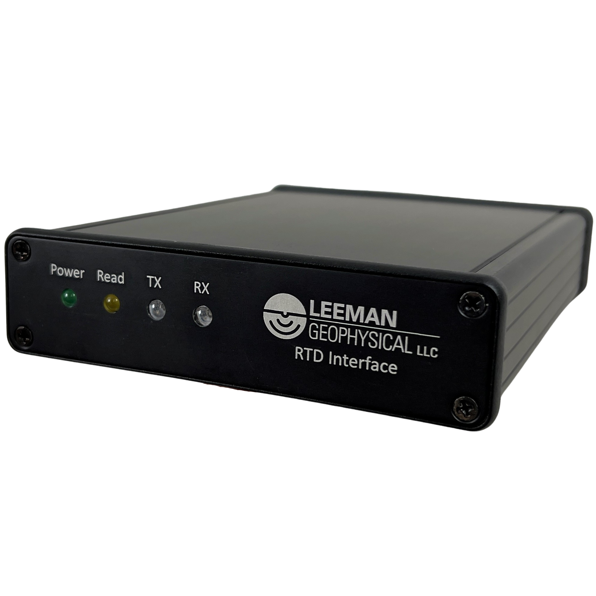
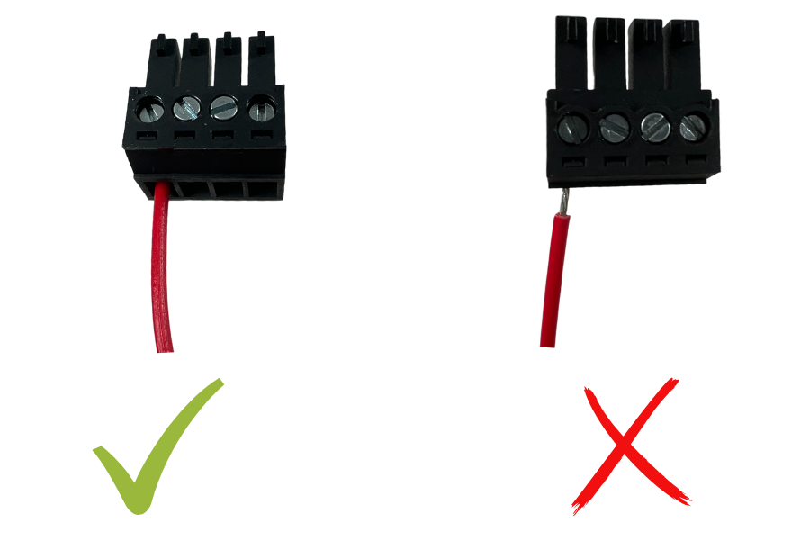
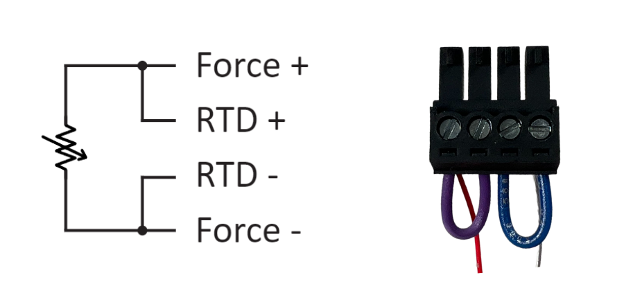
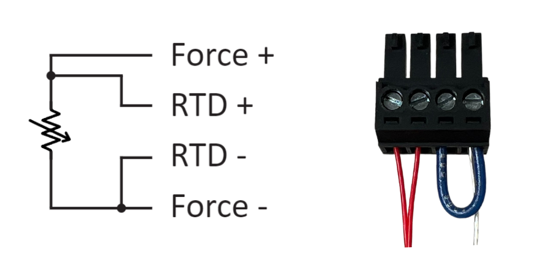
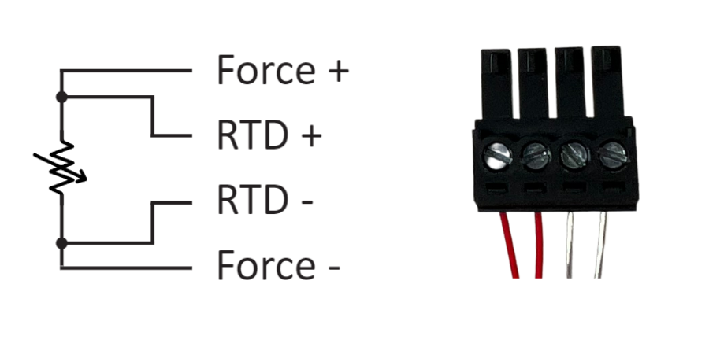

# 4 Channel RTD Interface

{: style="height:300px"}

This documentation covers part number <a href="https://leemangeophysical.com/product/4-channel-rtd-interface/" target="_blank" rel="noopener noreferrer">10-0000094</a>

## Overview
Resistance temperature detectors (RTDs) are precision temperature measurement
devices whose resistance varies with the temperature of the probe. RTDs are
generally used for higher resolution measurement of smaller temper- ature ranges
than thermocouples and are not dependent upon the same Seebeck voltage as a
thermocouple. Our 4 channel RTD Interface is a quick, economical, and accurate
way to interface RTDs to a variety of data acquisition systems and test
environments. Unlike many other signal conditioning solutions on the market, the
RTD Interface produces a digital output via a USB connection as well as an
analog voltage output that can be read and digitized by external systems. The
range of the voltage output is adjustable as well as the span of temperature
represented making it easy to scale data to areas of interest and utilize lower
bit depth measurement systems. This unit is designed to work with PT100 type
RTDs. If your system uses PT500 or PT1000 devices please contact the factory to
discuss options to connect your system to the 4 Channel RTD Interface device.

### Front Panel
The front panel of the instrument has four LED indicators on it.  

* **Power** - Green LED indicating the device is receiving power and on.  

* **Read** - Yellow LED indicating that the device is reading temperatures from
  the RTDs.  

* **TX** - Blue LED indicating the device is sending data over the serial
  connection to a host device.  

* **RX** - Blue LED indicating the device is receiving data over the serial
  connection from a host device.

### What's in the Box
Upon receipt of your unit, unpack the contents of the box and inspect all parts
for any damage incurred during shipping. Immediately report any missing parts or
damage to Leeman Geophysical for replacement. Note that there are many optional
accessories available, see the accessories section of the manual for details and
usage notes.  

* RTD Interface in anodized enclosure

* 5 Position plug-in terminal block  

* 4 Position plug-in terminal block (X4)  

* USB Cable  

* Factory amplifier calibration documentation  

## Specifications
<table>
  <tr bgcolor="gray">
    <td><b>Parameter<b></td>
    <td><b>Min<b></td>
    <td><b>Typ<b></td>
    <td><b>Max<b></td>
    <td><b>Unit<b></td>
  </tr>

  <tr>
    <td colspan="5" bgcolor="gray"><b>Environmental<b></td>
  </tr>

  <tr>
    <td>Operating Temperature</td>
    <td>-40</td>
    <td>-</td>
    <td>80</td>
    <td>&#8451;</td>
  </tr>

  <tr>
    <td colspan="5" bgcolor="gray"><b>Physcial<b></td>
  </tr>

  <tr>
    <td>Weight</td>
    <td>-</td>
    <td>0.43</td>
    <td>-</td>
    <td>kg</td>
  </tr>

  <tr>
    <td>Width</td>
    <td>-</td>
    <td>127</td>
    <td>-</td>
    <td>mm</td>
  </tr>

  <tr>
    <td>Length</td>
    <td>-</td>
    <td>166</td>
    <td>-</td>
    <td>mm</td>
  </tr>

  <tr>
    <td>Height</td>
    <td>-</td>
    <td>35</td>
    <td>-</td>
    <td>mm</td>
  </tr>
</table>

## Hookup
### USB Power and Communications
Power is provided via the USB mini-B port on the back of the unit. If the
interface will not be plugged into a computer for digital communications, it can
be powered with a simple USB wall power supply. The USB port also provides
communications to a host device as a serial connection using FTDI Technologies
interface devices. If your system does not already have FTDI Virtual
Communications Port (VCP) drivers installed, they may be downloaded at no cost
from FTDI at <a href="https://ftdichip.com/drivers/vcp-drivers/" target="_blank"
rel="noopener noreferrer">https://ftdichip.com/drivers/vcp-drivers/</a>. The
default baud rate of the device is 9600, though this is a user modifiable
setting. For the details on serial communications and commands, see the Serial
Command Interface section.  
If the interface is to be plugged into a USB hub device we recommend a powered
hub. Un-powered hubs may not be able to provide adequate supply power and result
in unstable behavior. If powering the interface from a wall supply, we recommend
a 500mA or greater supply to avoid issues.

### Using the Plug-In Terminals
The plug in terminals provided make creating your connections easy as they can
be connected in a convenient position and then simply plugged into position on
the back of the RTD interface. This also makes switching out a damaged unit or
troubleshooting much faster. To use the terminals, open the connection block
with a screwdriver. Strip and insert the wire, then tighten the terminal. Pull
to check for a secure connection. Ensure there are no stray strands of wire
adjoining adjacent connections and no exposed conductor which could be
hazardous. Also be careful to grip the actual conductor in the terminal, not the
outer insulator as this can cause high resistance and intermittent connections.

{: style="height:300px"}

{: style="height:150px"}

### 2-Wire RTD
Two wire RTDs are the simplest, though least accurate RTD model available. The
two wires carry the excitation current and are used to measure the RTD voltage.
Therefore some of the lead resistance is included in the mea- surement, so
keeping lead wires as short as possible is essential. To connect a 2-wire RTD to
the interface, one wire is connected to the Force + terminal and another to the
Force - terminal. Jumper wires (we recommend new, clean 22 gauge stranded wire)
are then inserted between Force - and RTD - as well as between Force + and RTD
+.

{: style="height:300px"}

### 3-Wire RTD
Three wire RTDs are more accurate than two wire RTDs as lead resistance concerns
are partially mitigated by the third conductor in the system. First, determine
which two of the three wires are connected together and which is the third wire.
Often these are color coded by the manufacturer, but this can also be determined
with a multimeter by measuring the resistance between wires. The pair with the
lowest resistance (a few Ohms at most) is connected. Insert one of the pair of
connected wires into the Force + terminal. Insert the other wire of the pair
into the RTD + terminal. Insert the third wire into Force - and install a jumper
(we recommend new, clean 22 gauge stranded wire) between Force - and RTD -.

{: style="height:300px"}

### 4-Wire RTD
Four wire RTDs are the most accurate RTD configuration and removes most lead
resistance errors. Two wires are connected to each end of the resistance element
in the sensor probe. Determine which wires are paired by measuring resistance
between wires with a multimeter. The pairs will have a few Ohms at most of
resistance while opposite ends will read near 100 Ohms. Many manufacturers color
code these pairs as well. Connect one of the low resistance pairs (either one)
to Force + and RTD +. Connect the other pair to Force - and RTD -.

{: style="height:300px"}

### Analog Output
The RTD interface can produce an analog output voltage in the range 0-10 VDC
which is linearly proportional to temperature over a user selected voltage and
temperature range. The output connections are ground referenced and available on
the 5 pin plug-in terminal block. The outputs should be buffered if driving any
load other than a high input-impedance device such as an analog to digital
converter system.

## Serial Command Interface
Settings of the RTD Interface are modified via a simple serial command
interface. For more information on using a serial terminal to communicate with
instruments, be sure to read our how-to post on the <a href="https://leemangeophysical.com/3-steps-to-using-serial-terminal-programs/" target="_blank" rel="noopener
noreferrer">company blog</a>.
The instrument is set from the factory to 9600 baud. Settings are stored in
non-volatile memory and kept through power cycles of the instrument.

### Command Listing
<b>Commands are all followed by a newline character.<b>
<table>
  <tr bgcolor="gray">
    <td><b>Command<b></td>
    <td><b>Description<b></td>
  </tr>

  <tr>
    <td>SETVMIN C XX.XXX</td>
    <td>Set the minimum output voltage on channel C</td>
  </tr>

  <tr>
    <td>SETVMAX C XX.XXX</td>
    <td>Set the maximum output voltage on channel C</td>
  </tr>

  <tr>
    <td>SETTMIN C XX.XXX</td>
    <td>Set the minimum temperature on channel C</td>
  </tr>

  <tr>
    <td>SETTMAX C XX.XXX</td>
    <td>Set the maximum temperature on channel C</td>
  </tr>

  <tr>
    <td>SETWIRES C X</td>
    <td>Set the RTD to 2, 3, or 4 wire configuration on channel C</td>
  </tr>

  <tr>
    <td>SETFILT C X</td>
    <td>Set the filter on channel C to 50 or 60 Hz</td>
  </tr>

  <tr>
    <td>SETRREF C XX.XXX</td>
    <td>Set the reference resistance on channel C</td>
  </tr>

  <tr>
    <td>SETRNOM C XX.XXX</td>
    <td>Set the nominal RTD resistance on channel C</td>
  </tr>

  <tr>
    <td>SETGAIN C XX.XXX</td>
    <td>Set the gain of the output amplifier on channel C</td>
  </tr>

  <tr>
    <td>SETOFF C XX.XXX</td>
    <td>Set the offset of the output amplifier on channel C in volts</td>
  </tr>

  <tr>
    <td>SETBAUD X</td>
    <td>Set the baud rate to X</td>
  </tr>

  <tr>
    <td>READ</td>
    <td>Force a reading regardless of mode or time settings</td>
  </tr>

  <tr>
    <td>RESET</td>
    <td>Restart the instrument</td>
  </tr>

  <tr>
    <td>SHOW</td>
    <td>Show the current configuration</td>
  </tr>

  <tr>
    <td>HELP</td>
    <td>Displays a help menu with a list of available commands</td>
  </tr>

  <tr>
    <td>DEFAULTS</td>
    <td>Resets all stored values to the factory default values</td>
  </tr>
</table>

### Command Descriptions
**SETVMIN** sets the minimum output voltage allowed on a given channel. This
value must be equal to or greater than zero and less than or equal to ten. No
matter the temperature on the sensor, this output voltage will be the minimum
allowable analog output on that channel.  

**SETVMAX** sets the maximum output voltage allowed on a given channel. This
value must be equal to or greater  
than zero and less than or equal to ten. No matter the temperature on the
sensor, this output voltage will be the maximum allowable analog output on that
channel.  

**SETTMIN** sets the minimum temperature to be registered on a given channel.
When the temperature is at this minimum the output voltage will be at the value
set by VMIN. This value must be greater than or equal to -200◦C and less than or
equal to 850◦C.  

**SETTMAX** sets the maximum temperature to be registered on a given channel.
When the temperature is at this maximum the output voltage will be at the value
set by VMAX. This value must be greater than or equal to -200◦C and less than or
equal to 850◦C.  

**SETBAUD**sets the baud rate of the device to a new rate. This change takes
effect immediately and the serial terminal utility will need to be disconnected
and reconnected at the new baud rate. Valid rates are 1200, 2400, 4800, 9600,
19200, 38400, 57600, 74880, and 115200 baud.  

**SETWIRES** sets the RTD wiring configuration to be 2, 3, or 4 wires on the
given channel. Though readings may be taken with an inaccurate setting of this
parameter, they may be incorrect.  

**SETFILT** sets the power line interference filter to be 50 or 60 Hz on the
given channel. In North America 60 Hz prevails and most European and Asian
counties are on 50 Hz power. This filter simply reduces this high frequency
noise on generally slowly changing temperature data.  

**SETRREF** sets the reference resistance for the given channel. This parameter
is set at the factory and should only be altered in advanced tuning of system
accuracy after consultation with the factory.  

**SETRNOM** sets the nominal resistance of the RTD for a given channel. This
parameter is generally set to 100 Ohms for PT100 devices, but can be altered
based on calibration data from your sensor’s manufacturer.  

**SETGAIN** sets the output amplifier gain on a given channel. This parameter is
set at the factory and should only be altered during factory calibration.  

**SETOFF** sets the output amplifier offset on a given channel. This parameter
is set at the factory and should only be altered during factory calibration.  

**READ** takes a reading from all RTDs.  

**RESET** takes a reading from all RTDs.  

**SHOW** Display the current instrument configuration.  

**HELP** displays a condensed version of the command help menu. This is very
helpful in the field as a quick reference without the instrument’s manual.  

**DEFAULTS** resets all user select-able settings to their factory defaults. The
instrument will be set at 9600 baud and all RTDs will be in 3-wire mode with
60Hz filters applied. Factory set amplifier gains and offsets will not be
altered.  

### Examples
* Set the minimum voltage on channel 1 to 1.5 *VDC SETVMIN 1 1.5*
* Set channel 3 to use a 4 wire *RTD SETWIRES 3 4*
* Change the baud rate to 115200 baud *SETBAUD 115200*

## Configuration
### RTD Settings
For each RTD connected to the unit, it is very important to set the correct
configuration settings. The SETWIRES command should be used to set the correct
number of wires (2, 3, or 4) for each RTD connected. There can be any
combination of 2, 3, or 4 wire RTDs connected to the unit. The SETFILT command
should be used to set the power line filter to the appropriate AC wall power
frequency for your region of operation (50 or 60 Hz). Generally all other
settings such as nominal and reference resistances are left at their default
factory set values unless calibration information is available from your RTD
manufacturer and you find it necessary to modify the RTD nominal resistance.

### Analog Output
The analog output of the unit is set on a channel by channel basis. At the value
of temperature set by SETTMIN the analog output will be that value set by
SETVMIN. At the value of temperature set by SETTMAX the analog output will be
that value set by SETVMAX. In between the voltage output will vary linearly with
temperature. An example calculation is provided below on how to determine the
calibration and output of the device.

#### Analog Output Example
The experimental setup considered in this example is designed to measure
temperatures of -100◦C to 80◦C. The RTD Interface analog outputs are connected
to a digitizer and a user set 1-5 VDC output range. Setting TMIN to be -100,
TMAX to 80, VMIN to 0 and VMAX to 5 we can calculate the following calibration
from volts to temperature.

$$ Temperature = Voltage~Out~({T_{max}-T_{min} \over
V_{max}-V_{min}})+(T_{max}-{T_{max}-T_{min} \over V_{max}-V_{min}}V_{max}) $$

#### Resolution Calculation Example
Assuming the signal from the example problem above is sent to a ideal zero noise
16-bit converter with an input range of 0-5 VDC we can calculate the ideal
minimum temperature resolution. First we must calculate the change in voltage
represented by one bit of the converter.

$$ Volts~per~Bit={V_{max}-V_{min} \over 2^n-1}$$

Setting $n$ to be 16 (the bit depth) and $V_{min}$ and $V_{max}$ are set to 0 VDC and 5 VDC
respectively we determine that the analog to digital converter has an ideal
resolution of 0.076 mV. Next we must calculate how much change in temperature is
represented by a volt of output change, the slope of our calibration.

$${T_{max}-T_{min} \over V_{max}-V_{min}}$$

This number comes out to be 45 degrees Celsius per volt. The product of this and
our ADC resolution of 0.076 mV yields an ideal resolution on the digitization of
0.003&deg;C. Of course noise in the digital to analog and analog to digital
conversion process will reduce this, but it may be used as a guideline when
deciding the range and resolution requirements of the RTD Interface and attached
hardware. Note that the RTD Interface itself uses a 12-bit digital to analog
converter for the output, so in this instance the resolution will be limited by
the output resolution (roughly 2mV or in this case 0.09&deg;C).

### Warm Up
To reduce drift, we recommend powering up the instrument at least 15 minutes
ahead of data collection to ensure the most accurate results. This may depend on
the ambient conditions and is generally very small error and the device
stabilizes quickly.

## Data Interpretation

{: style="height:150px"}

The data from the READ command is plain text ASCII. There are four tab-delimited
fields, each representing an RTD temperature. Temperatures are output in
calibrated degrees Celsius. These values can be recorded and interpreted by any
user written program or serial terminal program.

## Accessories
There are a variety of accessories available to make installing, deploying, and
using your interface easier! Contact us with any questions on which accessories
are appropriate for your deployment or for custom integration services.

### 4 Position Plug-In Terminal Block 1-0001141
Extra 4 position terminal blocks make having spare pre-wired RTDs on hand
possible and allow for rapid swap out of sensing elements.
### 5 Position Plug-In Terminal Block 1-0001149
Extra 4 position terminal blocks make having spare pre-wired RTDs on hand
possible and allow for rapid swap out of sensing elements.

## Revision History
<table>
  <tr bgcolor="gray">
    <td><b>Date</b></td>
    <td><b>Changes</b></td>
  </tr>

  <tr>
    <td>January 2023</td>
    <td>Initial Release</td>
  </tr>

  <tr>
    <td>Febuary 2023</td>
    <td>Update company address</td>
  </tr>

  <tr>
    <td>April 2024</td>
    <td>Moved Documentation to MkDocs Format</td>
  </tr>
</table>