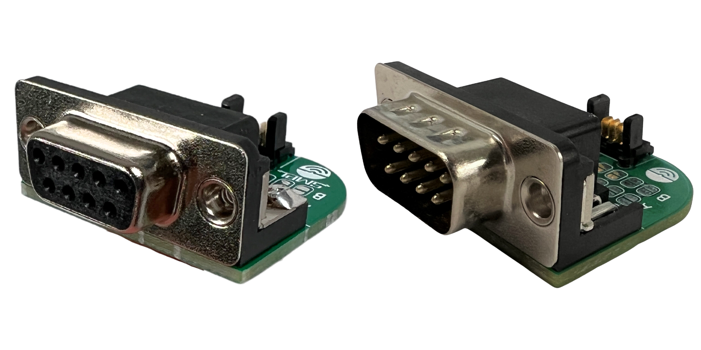
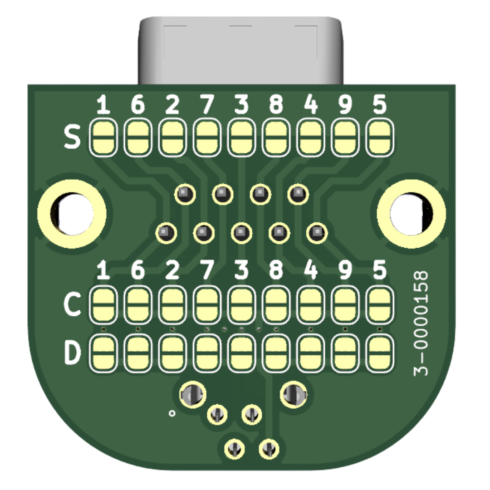

# SMPL DB9 Breakouts

{: style="height:300px"}

This documentation covers The following part numbers:  

* <a href="https://leemangeophysical.com/product/universal-db9-breakout-female/" target="_blank" rel="noopener noreferrer">7-0000145</a> (Female)

* <a href="https://leemangeophysical.com/product/universal-db9-breakout-male/" target="_blank" rel="noopener noreferrer">7-0000134</a> (Male)

## Overview
The SMPL DB9 Breakout allows the total configuration of connections between a
female or male DB9 connector to the 4 pins of our SMPL connector. This enables
you to effortlessly connect any DB9 to any 4-pin SMPL device, expanding
compatibility across your equipment. These Universal DB9 Breakouts utilize an
array of solder jumpers to configure a SMPL four position push connector to any
of the desired pins on a DB9. There are additional jumpers that allow you to
connect any of the DB9 Pins to the case ground without utilizing a pin of the 4
position connector. We have recommended pinouts for many types of sensors in the
[SMPL documentation](../smpl_standard.md), so don’t forget to check those out.

### What's in the Box
Upon receipt of your unit, unpack the contents of the box and inspect all parts
for any damage incurred during shipping. Immediately report any missing parts or
damage to Leeman Geophysical for replacement.  

* SMPL DB9 breakout PCB Assembly

### Tool Requirements
* Soldering Iron  

* Solder  

## Configuration 
There are a total 45 solder jumpers on the PCB assembly. These jumpers are found
in 5 rows and 9 columns where the rows **(A-D)** correspond to the pins of the
SMPL push connector, and the columns **(1-9)** relate to the 9 pins of the D-Sub
connector. The row and the column then describe the which two pins the jumper
will connect when soldered. Multiple pins on the D-Sub can be connected to the
same output pin if desired. The additional row of jumpers **(S)** serve to
connect pins from the DB9 directly to the casing of the D-Sub connector.

{: style="height:300px"}

{: style="height:300px"}

## Revisions
<table>
  <tr bgcolor="gray">
    <td><b>Date</b></td>
    <td><b>Changes</b></td>
  </tr>

  <tr>
    <td>May 2024</td>
    <td>Moved Documentation to MkDocs Format</td>
  </tr>
</table>