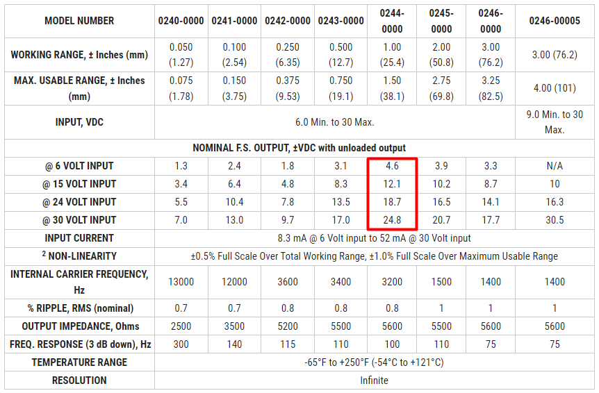
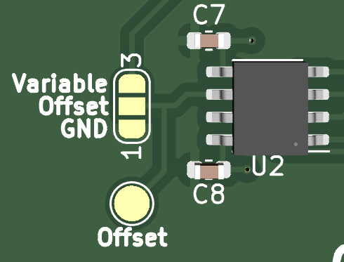
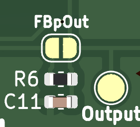

# DCDT Signal Conditioner

DCDTs or Direct Current Displacement Transducers are a very precise way to
measure the displacement in a system based on the movement of a magnetically
permeable core within a differential transformer. The transducer needs a stable
input voltage as the output is proportional to the input. The output voltage
range may need to be adjusted via the excitation voltage and/or an applied gain
or offset to achieve the desired mapping of physical displacement to voltage.

The DCDT Signal Conditioner allows the interface of most DCDTs to the SMPL
ecosystem with only minor adjustments needed to maximize the use of the
digitizer's full dynamic range. With on-board gain and offset controls the
signal can be amplified and offset to utilize a specific range of the DCDT's
movement to make a single transducer even more versatile in a variety of
scenarios.

## Hookup
1. Ensure all power is off. **DO NOT power on the system until all steps of
setup, including adjustment are complete, otherwise damage to the transducer may
result!**

1. Connect power to the PCB either via one of the two identical 4-pin SMPL
connectors labeled power or via the through hole terminals GND, VDC-, and VDC+.

1. Connect the transducer via the either the 4-pin SMPL connector labeled DCDT
or the through hole terminals GND, VEXC, -IN, and +IN. Reversing the input
connections will reverse the sign of the output.

1. Connect the output to the desired recording or measurement system via either
   the 4-pin SMPL connector or the through hole terminals GND, OUT.

1. Proceed to the adjustment section BEFORE powering on the system or damage to
your transducer may result!

## Adjustment

### Excitation Voltage
The excitation voltage of the circuit should be set to match the transducer's
acceptable input voltage range as well as the excitation required to achieve the
desired output voltages from the transducer. Adjustment of the output voltage
range via the excitation voltage is always preferred to using gain as the noise
of the output will be the least when no gain is applied.

1. Ensure that power is off to the system.

1. Setting the excitation voltage is most easily done with the transducer
connected, but be sure that either the transducer can handle the full range of
excitation voltages or that the Vexc potentiometer is turned all the way down
(screw counter-clockwise until a click is heard or approximately 15 turns)
before applying power to the system or damage to the transducer could result.

1. Apply power to the system and measure the output excitation voltage using a
multi-meter. This can be measured most easily at the GND and VEXC through hole
terminals on the circuit board.

1. Turn the potentiometer clockwise to increase the excitation voltage and
counter clockwise to decrease it.

1. Allow the unit to warm up under load for 30 minutes and repeat the
   adjustment.

As an example of determining a good starting point for the excitation voltage of
a DCDT, we will consider a transducer from TransTek Inc. The transducer
0244-0000 is a +/- 1 inch range transducer. From the data table below we can see
that at 6 VDC excitation it will output +/- 4.6 VDC at full scale and with 15
VDC excitation it will output +/- 12.1 VDC at full scale. 

*TransTek Inc. data table for the series 240 DCDT transducer line*

Suppose the system we want to connect to expects the full scale range to be
represented by a range of 10 VDC (with no offset that is a +/- 5 VDC output). We
can fit a line to the two data points from the datasheet to get equation:

$$ \text{Full Scale Output} = \text{VEXC} \times 0.833 - 0.4 $$

From this equation we can calculate that an excitation voltage of 6.482 VDC will
result in the desired output range from an ideal transducer. We may then set the
excitation to a voltage of 6.48 VDC and proceed to test the output range in our
system and adjust the excitation as necessary to dial in the required
performance.

### Gain and Offset
Gain applied to the transducer output and subsequent offset of the signal can be
accomplished, but are considered advanced applications and covered in the
Advanced Features section. Most applications are well served with no offset and
a unity gain as the DCDT output voltage can be adjusted via the excitation as
previously described. Therefore from the factory there is no gain or offset
applied.

## Testing
After the system has been connected and adjusted, move the transducer through
the full range of motion and observe the output on a multi-meter or the data
recording/digitization system. The output should vary in the desired voltage
range corresponding to full scale movement of the DCDT. A calibration stand or
ruler taped to the work surface may be helpful in moving the core of the DCDT
more precisely.

## Advanced Features

### Applying Offset
In some situations it may be desirable to offset the output of the system to
work with a given digitizer or other constraint. The DCDT Signal Conditioner has
the option to enable a variable offset allowing the zero output of the
transducer to be set to nearly the full input voltage of the circuit. Typically
this control is operated to offset the zero output to be within the range of -10
to 10 VDC.

To enable the offset feature, move the solder jumper labeled Offset from the GND
pad to the Variable pad. Now turning the Offset potentiometer clockwise will
increase the output offset and counter clockwise will decrease the offset. The
offset voltage may be measured directly using the test point labeled Offset and
any GND connection.

{: style="height:250px"}

*Offset jumper on the PCB. Bridge connections 1 and 2 for no offset. Bridge connections 2 and 3 for variable offset.* 

For example, consider the 0244-0000 transducer example from the excitation
voltage adjustment section. The transducer was setup such that it produced a +/-
5 VDC output for the full scale +/- 1 inch range. Now suppose our recording and
control system is only designed for an input of 0-10 VDC. The signal can be
offset by +5 VDC to achieve the goal. The offset feature can also be used to
create a false zero point. For example, if the desired output was 0 VDC when the
transducer was at a physical location of +0.25 inches, the offset could be set
to -1.25 VDC. Now the output of the transducer would be -6.25 to 3.75 VDC with
the zero volt output corresponding to a position of 0.25 inches.

### Applying Variable Gain
Some transducers may not produce a large enough output swing to maximize the
full dynamic range of the digitizer or connected system. Variable gain can be
applied to the signal to allow easy adjustment of the gain to optimize the
transducer to system match. 

Two solder jumpers must be closed to enable the variable gain potentiometer.
Once closed, the system will apply a gain set by the value of the potentiometer
according to equation below. The value of the gain resistor
can be measured by the two test points labeled Rg on the circuit board.

$$ \text{Gain} = 1 + \frac{49400 \Omega}{R_g} $$

{: style="height:250px"}

*Bridge the connections on the two gain jumpers to apply a variable gain. The gain resistance can be measured across the to test points labeled Rg.*

Gain can also be adjusted by setting the transducer at a known value (half full
scale for example) and changing the potentiometer until the desired output is
reached. Keep in mind that if an offset is being applied, it may be necessary to
adjust these two controls multiple times to achieve both the desired gain and
offset values. It may be easier to remove the offset, adjust the gain, then
apply the offset again.

As an example, consider the 0240-0000 transducer from TransTek. This transducer
will output 1.3 VDC at full scale when excited with 6 VDC. To increase that to a
value of 10 VDC for a +/- 10 VDC output range we would need to apply a gain of
10 / 1.3 = 7.69 times. Plugging this value into the gain equation rearranged:

$$ Rg = \frac{49400 \Omega}{\text{Gain} - 1} $$

We can determine the gain resistor should be set to a value of 7.384k&Omega;. We
can set the resistor, test, and make minor adjustments as necessary.
Alternatively we can apply a fixed gain as described in the next section. There
is a silkscreen printed area to write the applied gain value on for future
reference on the front of the circuit board.

### Applying Fixed Gain
Applying a fixed gain requires determining a gain resistor value and soldering
it onto the circuit board, but has the advantage of being able to apply a very
well known gain and reducing the effects of gain drift error from temperature
changes modifying the resistance of the potentiometer used to apply a variable
gain. This is the preferred method to apply gain, but requires additional parts
and is not easily adjustable in system to accommodate transducer or requirement
changes on the fly.

To apply a fixed gain, ensure that the solder jumpers for the variable gain
potentiometer are NOT bridged. Calculate the resistor value needed to achieve
the desired gain:

$$ Rg = \frac{49400 \Omega}{\text{Gain} - 1} $$

You'll need to then pick the closest standard value (E-Series) resistor to the
calculated value. Checkout our handy explanation of the E-Series resistors over
in [this blog post](https://leemangeophysical.com/why-standard-resistor-values-are-strange/).
If you do not want the gain to be any higher than the ideal gain, err on
choosing a resistor larger than the calculated value such that the gain would be
slighlty less than the calculated gain.

We recommend using 1% or better resistors with low thermal coefficients for the
best results. The resistor may be a through hole resistor and soldered into
position R5 (standing on end) or an 0603 surface mount resistor soldered to
position R4 on the circuit board. There is a silkscreen printed area to write
the applied gain value on for future reference on the front of the circuit
board.

{: style="height:250px"}

*Fixed gain can be set by populating the axial resistor footprint R5 or the 0603 surface mount footprint R4.*

### Reversing Polarity
While many transducer manufacturers will specify an output polarity for their
instruments, in some instances it is more useful for the output polarity of the
system to be opposite. For example, if used as a feedback signal in a PID
control system, the phasing of the actuator and feedback must be correct for
effective control. Since the DCDT output is differential, we can switch the
input connections to reverse the output polarity. While this can be accomplished
by reversing the connections at the transducer, it can also be done by reversing
the input connections using the polarity solder jumpers.

To reverse the input polarity change the solder bridge nearest the connector
labeled DCDT to -IN and the jumper nearest the connector labeled Output to +IN.
This will connect the nominally -IN pin to the +IN terminal of the
instrumentation amplifier and the +IN pin to the -IN terminal.

{: style="height:250px"}

*Input polarity of the transducer can be reversed by moving the solder bridges on the jumpers to the positions most inner to the centerline of the PCB.*

\paragraph{Input Filter Adjustment and Bypass}\mbox{}\\
The mathematics of differential filters are discussed in the section on filtering and should be referenced
if modification of the stock filter is required. The stock filter is a simple RC filter with a corner frequency for
differential signals of 2.2kHz and a common mode corner frequency of 6.6kHz. For many displacement 
applications these are well above the expected mechanical movement frequency of the system and simply
help reduce noise on the signal from high frequency sources. In some systems they may need to be
modified to meet the application's data acquisition requirements. To completely bypass the filters the filter 
bypass jumpers by be bridged (FBp1 and FBp2). 

{: style="height:250px"}

*The input filter can be bypassed by bridging the connections on the jumpers labeled FBp1 and FBp2.*

### Output Filter Adjustment and Bypass
The analog output of the circuit is not filtered in any way. The output filter
bypass jumper FBpOut is closed from the factory. If a low pass filter is desired
it may be implemented after the output or resistor R6 and capacitor C11 may be
populated to form a simple RC filter.

{: style="height:250px"}

*The output can be filtered with a simple RC filter by populating the components R6 and C11 and removing the solder bridge from FBpOut.*

## Troubleshooting

**Issue: No change in output when transducer is moved.**

* Verify that all connections are correct.

* Probe the Output test point with respect to ground. If signal is present, the issue is after the circuit or
with the output connection itself.

* Verify that the input polarity solder jumpers are set (see Advanced Features).

* Verify that the offset solder jumper is set (see Advanced Features).

**Issue: Offset potentiometer has no effect.**

* Verify that the offset solder jumper is set to Variable (see Advanced Features).

**Issue: Gain potentiometer has no effect.**

* Verify that both Rg solder jumpers are closed (see Advanced Features).

## Specifications
<table>
  <tr bgcolor="gray">
    <td><b>Parameter</b></td>
    <td><b>Min</b></td>
    <td><b>Typ</b></td>
    <td><b>Max</b></td>
    <td><b>Unit</b></td>
  </tr>

  <tr>
    <td colspan="5" bgcolor="gray"><b>DC Input</b></td>
  </tr>

  <tr>
    <td>Voltage +</td>
    <td>13</td>
    <td>15</td>
    <td>17</td>
    <td>VDC</td>
  </tr>

   <tr>
    <td>Voltage -</td>
    <td>-13</td>
    <td>-15</td>
    <td>-17</td>
    <td>VDC</td>
   </tr>

  <tr>
    <td>Current</td>
    <td>-</td>
    <td>-</td>
    <td>-</td>
    <td>mA</td>
  </tr>

  <tr>
    <td colspan="5" bgcolor="gray"><b>Transducer Excitation</b></td>
  </tr>

  <tr>
    <td>Voltage</td>
    <td>-</td>
    <td>-</td>
    <td>-</td>
    <td>VDC</td>
  </tr>

  <tr>
    <td colspan="5" bgcolor="gray"><b>Physical</b></td>
  </tr>

  <tr>
    <td>Weight</td>
    <td>-</td>
    <td>-</td>
    <td>-</td>
    <td>g</td>
  </tr>

  <tr>
    <td>Width</td>
    <td>-</td>
    <td>-</td>
    <td>-</td>
    <td>mm</td>
  </tr>

  <tr>
    <td>Length</td>
    <td>-</td>
    <td>-</td>
    <td>-</td>
    <td>mm</td>
  </tr>

  <tr>
    <td>Height</td>
    <td>-</td>
    <td>-</td>
    <td>-</td>
    <td>mm</td>
  </tr>
</table>
