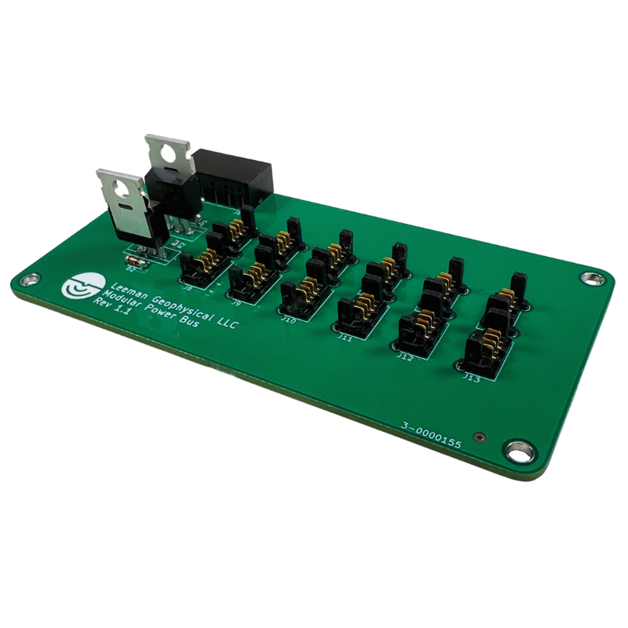
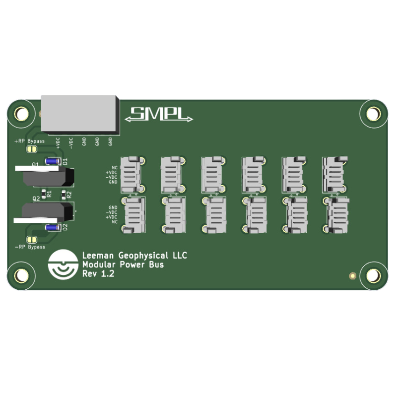

# SMPL Power Bus

{: style="height:300px"}

This documentation covers part number <a href="https://leemangeophysical.com/product/smpl_modular_power_bus/" target="_blank" rel="noopener noreferrer">7-0000164</a>

## Overview
Sometimes you have a LOT of SMPL boards you need to power. While many of the
boards can be chained together, if you have several high power draw devices such
as relay boards or want to implement a star power/grounding setup to help reduce
offset error, the power bus is the perfect solution.  
  
The reverse polarity protection can be bypassed if you wish, allowing the power
bus to simply be treated as a SMPL 4 pin splitter and letting you distribute any
power rails (or even signals) to a gaggle of SMPL devices! Just close the 2
labeled solder jumpers and you’re all set.  
  
Wiring is made a breeze with the 5-terminal screw block for power connection,
which can be easily removed for hassle-free installation in tight spots. Empower
your projects and devices with the SMPL Power Bus – the key to powering all your
SMPL boards effortlessly and efficiently. Upgrade your setup today for a
seamless and reliable power distribution experience!

### Features  

* Reverse polarity protection (and bypass)

* 12 Power Connectors (4 pin SMPL)

* Can be used for any unipolar or bipolar power distribution  

* Removable terminal block to make servicing and swap out easy

### What's in the Box
Upon receipt of your unit, unpack the contents of the box and inspect all parts
for any damage incurred during shipping. Immediately report any missing parts or
damage to Leeman Geophysical for replacement.

* SMPL Power Bus PCB Assembly

* 5 Pin Removable Terminal Block Connector

## Setup
1. Connect a power supply to the 5 position removable terminal block. View the
   [SMPL Standards](../smpl_standard.md) page for the various power pinout
   configurations used in the SMPL system.
1. Use the 4 position SMPl cables to connect up to 12 devices

{: style="height:500px"}

