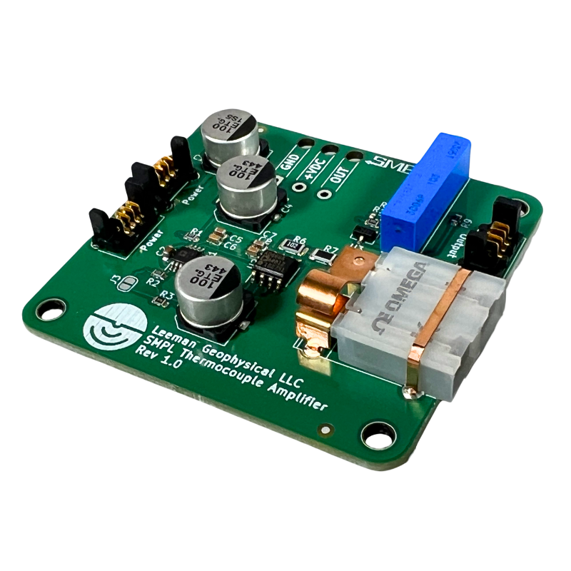

# SMPL Thermocouple Amplifier for Type K Sensors

{: style="height:300px"}

This documentation covers The following part number: <a href="https://leemangeophysical.com/product/smpl-thermocouple-amplifier-for-type-k-sensors/" target="_blank" rel="noopener noreferrer">7-0000203</a>

## Overview
Expand your temperature measurement capabilities with the new SMPL Thermocouple
Amplifier, specifically designed to integrate seamlessly into the SMPL system.
This advanced amplifier converts the tiny voltages produced by Type K
thermocouples into a clean, linear analog output that is easy to record and
interpret over a wide temperature range.

Ideal for systems already utilizing analog-to-digital converters for other
process measurements, the SMPL Thermocouple Amplifier offers precise temperature
monitoring, ensuring your processes are running optimally. Whether you’re in an
industrial setting or a research environment, this amplifier provides the
accuracy and reliability you need.

### Features
* <b>Seamless Integration:</b> Easily connects to the SMPL system, enabling quick and straightforward setup.
* <b>Wide Temperature Range:</b> Measure temperatures from -25 °C to +400 °C, suitable for most applications.
* <b>Clean Linear Output:</b> Produces a proportional analog output of 6.7mV/°C, making temperature data simple to interpret.
* <b>Versatile Applications:</b> Perfect for monitoring temperatures in industrial processes, laboratory experiments, and more.

### What's in the Box
Upon receipt of your unit, unpack the contents of the box and inspect all parts
for any damage incurred during shipping. Immediately report any missing parts or
damage to Leeman Geophysical for replacement.  

* SMPL Thermocouple Amplifier for Type K Sensors PCB

## Technical Specifications
* <b>Ambient Temperature Range:</b> 0 °C to 50 °C
* <b>Linear Measurement Range:</b> -25 °C to +400 °C
* <b>Output:</b> 6.7mV/°C and 1.3448 V at 0 °C
* <b>Connections:</b> 6.7mV/°C and 1.3448 V at 0 °C

## Revisions
<table>
  <tr bgcolor="gray">
    <td><b>Date</b></td>
    <td><b>Changes</b></td>
  </tr>

  <tr>
    <td>June 2024</td>
    <td>Initial Release</td>
  </tr>
</table>

