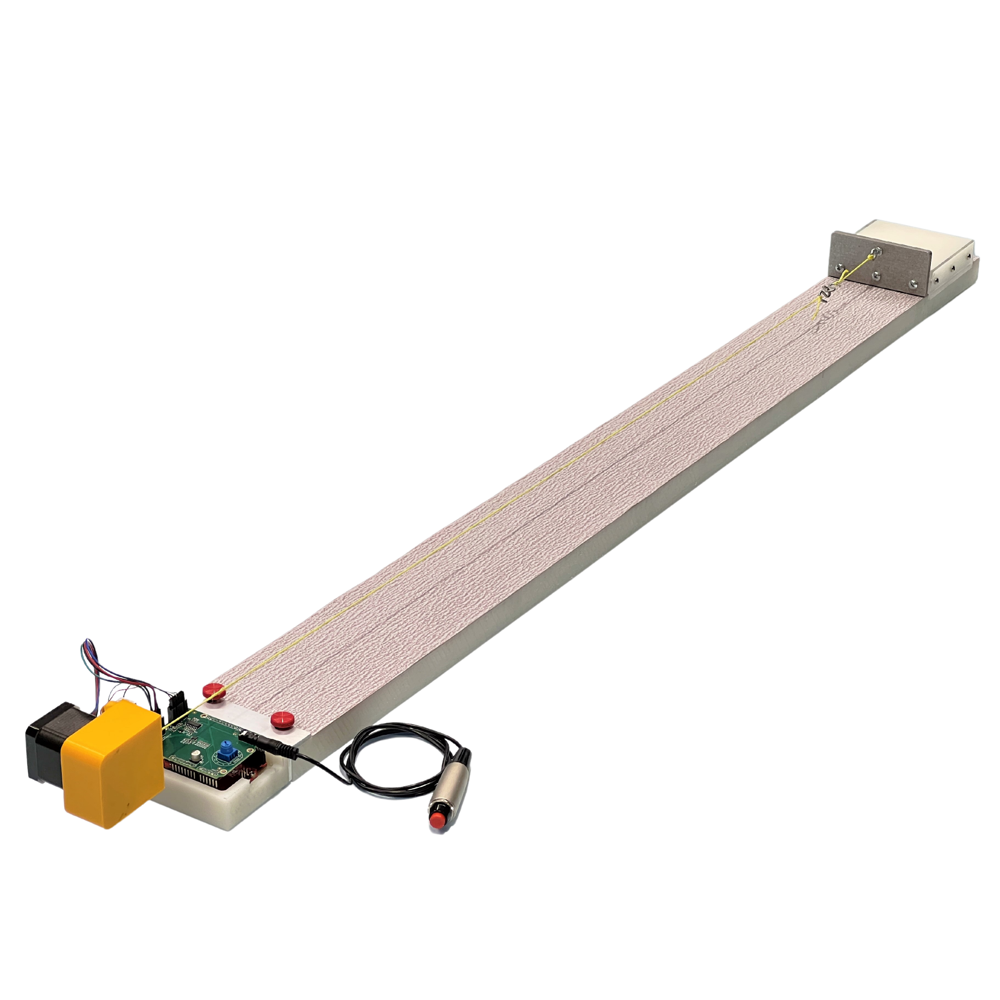
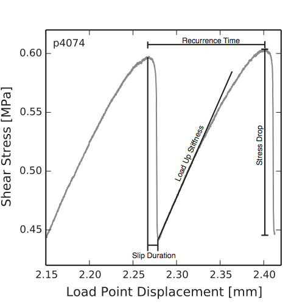
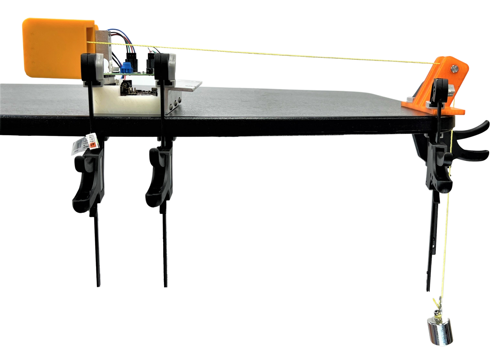
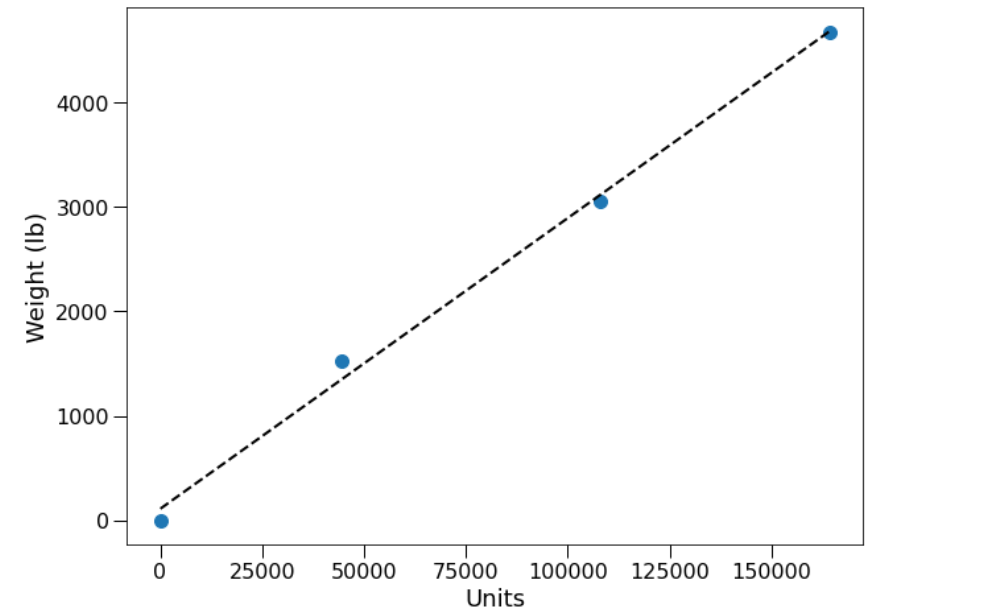

# Spring Slider Earthquake Machine

{: style="height:250px"}

This documentation covers part number [10-0000149](https://leemangeophysical.com/product/spring-slider/).

## Overview
The Spring-Slider Apparatus is a lab activity that demonstrates the physics of stick slip movement between two
surfaces. It is able to measure and record shear loads up to 1kg (2.2 lbs) and can be used to collect data for later
analysis, as well as for simple qualitative demonstrations.

### Components
* Slider Base
* Adhesive Sandpaper Strips (100, 120, 220 Grit Sheets)
* Slider Block
* Electronics Module
* Button Pendant
* 12VDC Power Supply
* 6 ft. USB Cable
* Assorted Spring Packet

### Initial Assembly
1. Loosen the 2 red thumb screws located at the end of the slider base. Line up
the electronics module, such that the two slots on the metal bracket slide
underneath the thumb screws. Push the two pieces together then tighten down the
thumbscrews until snug.
1. Take the S-Hook from the motor pulley, and the S-Hook from the slide unit and
connect each hook to different ends of one of the assorted springs.
1. Plug in the hand control pendant to the circuit board located in the bottom
   left of the control PCB.
1. If the motor and load cell do not arrive connected, connect them to the J1
and J2 connectors labeled **Motor** and **Load Cell** in the image below.
1. When ready, connect the AC Power adapter jack into the port located at the
   back left of the device.

{: style="height:400px"}

## Teachers Guide
### Introduction
Tectonic plates move, driven by forces in the mantle, and constantly induce
stresses in the Earth’s crust. When rocks slide past each other, they can either
move smoothly or they can move in a stop-start “sticky” fashion. Smooth movement
means that that plate boundary does not store energy and is not prone to
earthquakes. Stick- slip movement, on the other hand, stores energy in the rocks
through their elastic properties and can result in earthquakes.

{: style="height:100px"}

We call the boundary where the earthquake occurs a fault - or a boundary on
which the slip of an earthquake occurs. The rock surrounding the fault is often
called “country rock” and is the rock that gets stretched or compressed by plate
movement to store energy for an earthquake. Think of this process as stretching
a rubber band - and eventually the rubber band cannot stretch any further and
fails, releasing that stored energy in a sudden fashion.  

To learn more about how faults work, and what can determine if a given fault is
prone to earthquakes or to smoothly slipping, scientists needed to create a
simple model. The simplest model of the system is called the “spring-slider” and
is what we’ll be using to explore the physics of earthquakes.  

In our simplified model, there is a base plate representing one side of the
fault and a slider that repre- sents the other side of the fault. A motor pulls
the slider across the base plate, putting energy into the system just like the
driving forces of plate tectonics. We use a spring to represent the elasticity
of the rocks that store up energy for an earthquake. By changing the spring we
can simulate different rocks (some are more squishy than others), by changing
the speed of the motor we can change the simulated loading rate from plate
movement, by changing the load on the slider we can simulate pore
pressures/different normal loads, and by changing the interface material we can
simulate different rock frictional properties.  
Thanks to the decades of rock mechanics studies, done by friction researchers,
seismologists, and physicists, we know that there are MANY factors that
determine how a given fault is going to behave. These factors include: rock
stiffness, frictional properties of the rock, fluid in the fault, pressures in
the fault, loading rate, temperature, and more! In labs around the world
researchers are studying each of these and working to develop more advanced
models to better understand faults.  

When faults are unstable (prone to having earthquakes), they generally have
repeating earthquakes as part of the earthquake cycle. During this cycle the
rocks are stretched and loaded for some time. The stiffness of the rocks is
represented by the slope of the displacement-stress line. When the fault cannot
take any more load, failure occurs and the fault moves for some slip duration
that is much shorter than the loading time. During the failure, energy is
released resulting in a stress drop on the system. The process then repeats over
and over again at some recurrence time interval.

{: style="height:100px"}

{: style="height:100px"}

Real earthquakes may take hundreds or thousands of years to accumulate the
energy that they release in only a few minutes. Earthquakes can also be
triggered by other earthquakes, changes in water pressure on the fault, or a
host of other factors.  

#### [Lab Activity](https://docs.google.com/document/d/18YKNOFFVs2ug316g7z305HmLGav2u7MKnxVk-mrj-E4/edit#heading=h.dj54izm0lwup)
In this lab, you’ll explore the role of a few variables on the earthquake cycle
of a spring-slider model. Try to imagine how much more energy is at work in a
real earthquake where the blocks of rock can be the size of a country!

## Operation Guide
### Basic Operation
The following steps will outline the basic mechanical operation of the
Spring-Slider Apparatus.
1. Plug the AC power adapter into the wall and into the power port on the
   spring-slider machine.
1. Plug the AC power adapter into the wall and into the power port on the
   spring-slider machine.
1. Pull the pull string to unwind it from the pulley. Lights on the board may
   illuminate, this is normal.
1. Hook the S hook of the pull string to the slider using the desired spring.
1. Ensure that the pulley guard cover is in place before any use - failure to
use the pulley guard may result in injury!
1. Set the speed slider to mid-range and press the hand pendant. The motor
should begin to run and will run until you release the button on the hand
pendant.
1. The speed control knob, located on the control unit, can be adjusted at any
   time to change the motor speed.

### Recording Data
#### Data Format and Serial Connection
Data are sent in plain ASCII text over a serial connection to the computer. The
computer is not required to run simple experiments, but collecting data will
provide more insight into the processes happening and get students comfortable
with reading real data, applying calibrations, and critical analysis.  
The serial connection can be made with any serial terminal program or our
purpose built software, described below. The data are sent at 115200 baud with 8
data bits, no parity, and one stop bit.  
All data are command delimited, meaning there are commas separating different
variables. The first data element is the number of milliseconds since this run
began. Next is the current stepper motor distance traveled in steps, then the
load cell in a unit-less load reading. These are followed by a carriage return
and newline character to start the next data line. If desired, the distance and
load can be turned into engineering units. See the sections on determining
calibrations.

#### Using Leeman Geophysical Software
(*This software is available for free in the documentation section of the product
on our website [HERE](https://leemangeophysical.com/product/spring-slider/#)*)  
The Springs Slider Apparatus software collects data from the instrument and
plots all of the following:

* Stress over Time
* Stress over Displacement
* Displacement over Time  

1. Ensure the device is powered.
1. Connect the included USB cable into the back of the control unit (Next to the
power port), then plug the other end into an open USB port on your computer.
1. With power connected to the device, open up the Spring-Slider Software.
1. Once the Spring-Slider software is open, click the drop down arrow on the
**Serial Port** tab. Select the COM Port you are currently using. If you are
unsure of which port you are using, remove the USB cable from the computer, open
the **Serial Port** tab again and observe which port is no long available. Plug
the USB Back in and select the port that had previously disappeared.
1. With the correct serial port connected, the device is ready to log data. The
software will begin logging data upon pressing the button and will stop when the
button is released.
1. Use the **Clear** button in the top right of the software window to clear the
data  
*Note: The data must be cleared before running a new test*
1. Collected Data can be saved to any desired directory via the save button.

#### Using a Terminal Program
Data may also be recorded using any serial terminal program you like such as RealTerm, CoolTerm, and more.
Simply connect to the apparatus using the serial parameters outlined above and utilize the software’s recording
features. Here we outline the process for using CoolTerm, freely available from [https://freeware.the-meiers.org/](https://freeware.the-meiers.org/)

* Start the CoolTerm program.
* Click the **Options** button and in the Port selection and find the serial
port of the spring-slider. If you are unsure which port is correct, unplug the
USB cable from the computer and click the **Re-Scan Serial Ports** Button.
Whichever port disappears is the spring slider. If you do not see a port
associated with the apparatus, consult the troubleshooting guide.
* Ensure that **Baudrate** is set to 115200, **Data Bits** to 8, **Parity** to
none, and **Stop Bits** to 1.
* Click **OK** to close the options window.
* Click the **Connect** Button
* After a few seconds, press the pendant button of the spring-slider and data
should flow across the screen until the button is released. If so, you have
successfully connected.
* Click the **Clear Data** button to clear the screen of data.
* To record data, in the **Connection** menu select the **Capture to Binary/Text
File** option and click **Start**. Name your file and select its save location.
Data will be saved until you go back to this menu and select **Stop**. We
recommend only saving one run to one file and naming the file with the
conditions of the run such as *run1_velocity5_waterbottle_spring3.txt*.
* When you are done with experiments, just click the **Disconnect** button.
* Read the text files into your favorite analysis program such as Excel, Python,
Matlab, or many others.

### Sandpaper Replacement
As experiments are run on the Spring-Slider Apparatus, the sand paper used will
wear and require replacing for the best results. This product comes with three
grits of 48" X 4.5" adhesive backed sand paper strips. Replacement strips are
available for order from our website.

* 100 Grit (Part Number [2-0000236](https://leemangeophysical.com/product/adhesive-sandpaper-rolls-100-grit/))
* 120 Grit (Part Number [2-0000238](https://leemangeophysical.com/product/adhesive-sandpaper-rolls-120-grit/))
* 220 Grit (Part Number [2-0000240](https://leemangeophysical.com/product/adhesive-sandpaper-rolls-220-grit/))

1. Remove any worn sand paper from the slide platform and the bottom of the
slider.
1. Thoroughly clean the surface of the slide platform and slide with a lint free
rag and isopropyl alcohol.
1. Beginning at the far end of the base slider plate (away from the motor),
carefully place the new sand paper strip parallel and flush with one edge of the
base plate. For smoothest application, apply the sandpaper from end to end in a
continuous smooth motion with tension to prevent any lumps from forming. You may
want to use a smooth metal object such as a screwdriver handle to burnish out
any bubbles, just be careful to not remove the abrasive from the sandpaper.
There will be excess sandpaper. This will be used for the slider block.
1. Take a smooth edged metal object (screw driver shaft, metal tool handle,
etc.), and firmly run it along the edges of slide platform, at a 45° angle,
where the sandpaper overhangs the platform. This will create a lighter colored
score line and help burnish the edges to the plastic to prevent peeling.
1. Take a sharp disposable razor blade and carefully run it along the scored
edges from underneath, on the adhesive side. Be cautious to avoid cutting into
the plastic of the slide platform.
1. Take the excess sand paper from your used strip, and apply it to the bottom
of the slider following a similar procedure. The guide rails on the sides of the
slider will prevent any overhang and thus the scoring method. Measuring and
pre-cutting is the easiest way to apply the slider sandpaper.
1. Firmly press the sandpaper on both surfaces down one final time to ensure the
best adhesion.

### Calibrating Load Readings
While all lab activities can be done in the arbitrary load units displayed, some
users may want their students to get data in engineering units such as kilograms
and have the experience of applying a sensor calibration factor. Students may
even be assigned the calibration if desired. The optional calibration kit
(10-0000093) includes all accessories needed to calibrate the system easily. To
calibrate the load cell a series of at least three, though five are recommended,
known weights are applied and the load readings recorded. Scale weight sets can
be used, but so can a water bottle as long as you have a scale to weigh it on.
Simply add more water for each calibration point.

{: style="height:300px"}

1. Remove the electronics module from the slider base by loosening the
thumbscrews and sliding the unit off the base.
1. Using a clamp, gently clamp the module down approximately 6 inches or more
from the edge of a table. Similarly, clamp a pulley down at the table edge as
shown below. The clamps, pulley, and mass bottle can all be ordered as a kit
from our website.
1. Run the string from the motor over the pulley and off the edge of the table.
1. Unplug the 4 position motor connector labeled J2 from the circuit.
1. Put the mass bottle on a scale and pour in water until the total mass reads
   250 grams.
1. Press the control pendant to start recording data in the program of your
choice. Once the recording has started, hang the mass bottle from the S hook.
The change in units from the zero mass to 250 grams are your first two data
points.
1. Repeat this process for 500, 750, and 1000 grams. **Do not exceed 1000 grams
total load or the load cell may be damaged**.  
**NOTE:** *Be sure to start recording with no mass each time as the load cell
reading is tared to zero when the control pendant button is pressed.*
1. Make a plot of your readings with the reading from the instrument on the x-axis and the actual mass applied
on the y-axis. It should be a line similar to that shown below. The slope of that line is the calibration factor
in grams/units that you need to multiply your readings by to get force in grams.

{: style="height:200px"}

### Calibrating Displacement Readings
Displacement standards are generally expensive and difficult to use, but our
stepper motor moves a precise rota- tional angle per step, so we can calculate
the displacement calibration in a few simple steps.

1. Using a set of calipers, measure the small diameter of the pulley where your
pull string wraps. It should be near 12.7 mm.
1. The stepper motor is configured to make one complete revolution every 800
steps. Knowing this we can now calculate the total linear distance per
revolution and distance per step.

    $$distance~per~revelution = \pi pulley~inner~diameter$$
    $$distance~per~step = {distance~per~revolution \over steps~per~revolution}$$

For example, on a pulley with a diameter of 12.5 mm, we calculate 0.049 mm/step. This is the calibration that
needs to be multiplied by your distance output in steps to convert it to mm.

## Tips and Troubleshooting
### Tips
* It is often helpful to put a little bit of normal load on the slider. A water
bottle is a good place to start, but scale calibration weights or other masses
can be used. Just don’t put too much weight on or some springs may permanently
deform.
* Friction can be greatly affected by environmental factors like humidity, so
results from lab to lab may change slightly.
* Sandpaper strips generally last about 10-40 runs depending on the weight and
  speed.

### Troubleshooting
* **Motor:** If the motor is behaving oddly, barely moving, or not moving at all.
    * Ensure that the motor connector is plugged firmly into the 4 Position J2
      Connector.
    * Ensure that there are no breaks in the wires.
    * Check that the control unit is receiving power through included AC power
      adapter.  
      **Note:** *If the USB Cable is connected, and the AC Power Adapter is
      not, the motor move, but will not behave properly*
* **Load Cell:** If data is not being properly logged by the included
  Spring-Slider software.
    * Ensure that the load cell connector is plugged firmly into 5 Position J1
      Connector.
    * Ensure that there are no breaks in the wires.
* **Push Button:** If the push button is not activating the device.
    * Ensure the cable has no severe kinks or breaks.
    * The push button can be tested with a multi-meter in continuity mode by
      probing across the two contact surfaces on the jack, and pushing the
      button.
    * Review the motor trouble shooting steps if the issue is not resolved.
* **Serial Connection:** If you cannot connect to the device.
    * Ensure you are using the provided USB cable, some power-only cables will
      not provide a data connection.
    * Install the FTDI VCP drivers available at
      [https://ftdichip.com/drivers/vcp-drivers/](https://ftdichip.com/drivers/vcp-drivers/)
    * Ensure you have selected the correct serial settings as outlined in the
      serial connection section.

## Accessories
There are a variety of accessories available for the earthquake machine! Contact
us with any questions.

### Calibration Kit 10-0000093
This kit includes everything you need to calibrate the load and displacement
readings from the spring slider to real units of force and displacement! A
weighted bottle is used to calibrate the load cell and displacement can be
calculated based on measurements of the system’s pulley.

### Adhesive Sandpaper Rolls [2-0000236](https://leemangeophysical.com/product/adhesive-sandpaper-rolls-100-grit/), [2-0000238](https://leemangeophysical.com/product/adhesive-sandpaper-rolls-120-grit/), [2-0000240](https://leemangeophysical.com/product/adhesive-sandpaper-rolls-220-grit/)
These replacement sandpaper strips are adhesive backed and 4 feet long to
replace the sandpaper on your base and slider as it wears out with use.
Sandpaper is available in 100 grit (2-0000236), 120 grit (2-0000238), and 220
grit (2-0000240). Don’t forget to stock up as sand paper is a consumable!

## Revision History
<table>
  <tr bgcolor="gray">
    <td><b>Date</b></td>
    <td><b>Changes</b></td>
  </tr>

  <tr>
    <td>May 2022</td>
    <td>Initial Release</td>
  </tr>

  <tr>
    <td>Febuary 2023</td>
    <td>Update company address</td>
  </tr>

  <tr>
    <td>April 2024</td>
    <td>Moved Documentation to MKDocs Format</td>
  </tr>
</table>

